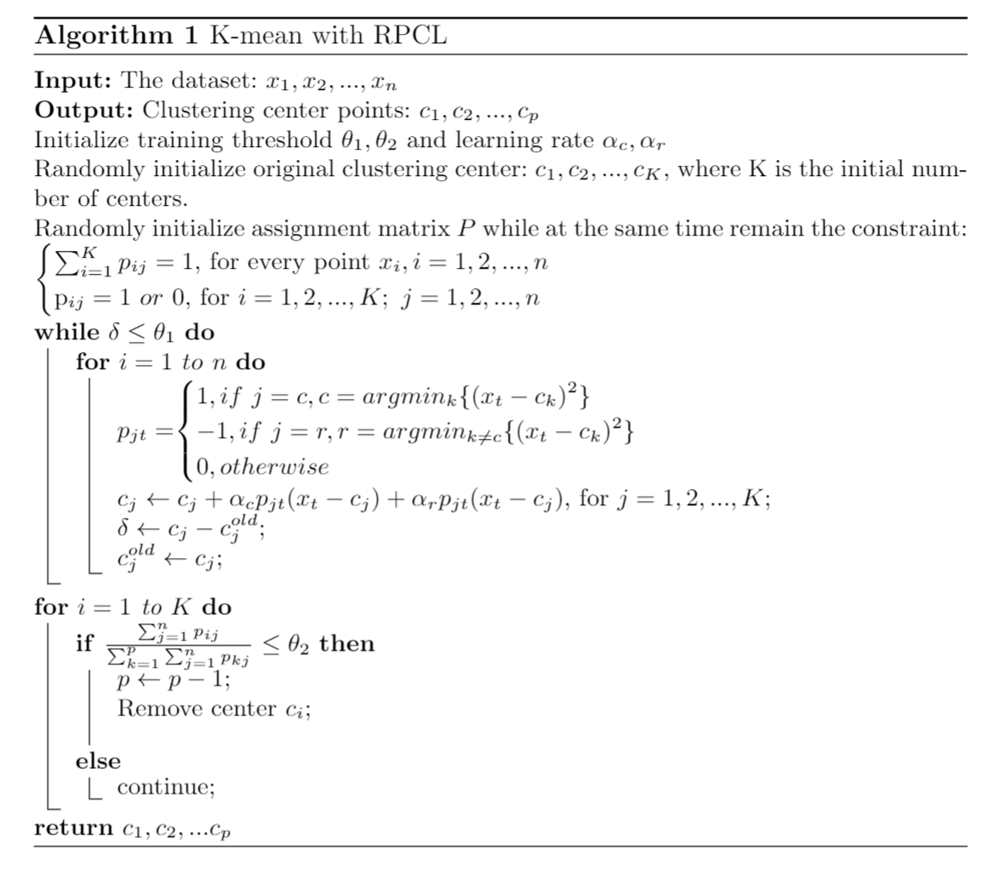

# Assignment 1

Name：Shiqu Wu

Student ID：518021910665

1.

(1.1)

The detailed proof has been raised during the lecture.  And here I briefly state the main idea of the proof.  We know that the K-mean algorithm consist of  the following two steps: 1. Assignment step  2. update step. In order to prove that the above two steps will never increase the k-mean objective function, we separate it to two sub-proof.: 

- Firstly, we prove that step (1)  satisfies the condition.  For the fact that $(x_n-u_i)^2<=(x_n-u_j)^2, for\ j = 1,2,...K$  if $u_i$ is the nearest cluster center. It's obvious that step (1) will never increase $J(u_1,...,u_K)$. 
- Secondly, we prove that step (2) satisfies the condition.  Here is an well known theory for arithmetic sum of squares: $ \sum_{x_i\in N_i}||x_i-u_x||^2<=\sum_{x_i\in N_i}||x_i-u_i||^2$, where $u_x$ is the average value of $x_i$:  $u_x=\frac{\sum_{i=1}^{n}x_i }{n}$.  Thus, step (2) will increase $J(u_1,...,u_K)$. 

In summary, both two steps will never increase the k-mean objective function. Therefore,  the proof is done.

2.

(2.1)


(2.2)

#### Advantages:

1.  Better performance.
2.  No need to make an assumption (Gaussian Distribution) for the input dataset. Theoretically, it can fit any kind of distribution. 
3.  More robust. Due to the use of soft assignment instead of hard assignment.

#### Disadvantages:

1.  User need to determine the number of cluster centers $K$.
2.  High computational cost compared to K-mean.
3.  Based on EM algorithm, so it's likely to stuck in local optimal. And the performance highly depends on the initialization.

3.

(3.1)

#### Comparison between K-mean and Competitive learning:

Main components of CL and K-mean:

1. **Competitors**  --> K-mean cluster centers
2. **Competing rules**  --> E step in K-mean. 
   1. winner takes all/most
   2. punish frequent winner
   3. punish second winner

1. **Update rules**  --> M step in K-mean
   - gradient update

What is CL:

Competitive learning is a learning theory that **Competitors** use **Competing rules** to scramble for resources, and use the resources to update themselves according to **Update rules**, which makes them more competitive in the next turn.  It's intuition comes from rule of "Winner takes all/most" and law of expanded reproduction in real world.

(3.2)



(3.3)

#### Experiment Results:

**Dataset:**


**Initial state:**		(black points represents randomly initialized center)


**State after running RPCL:**   	(red points represents cluster center)


4.

(4.1)

#### AIC,BIC:

AIC (Akaike Information Criterion) and BIC (Bayesian Information Criterion) are metrics for choosing the best model. In order to solve model selection problem, scientists introduce these metrics to quantify the effectiveness and efficiency of models.  They reflect the trade-off between the **complexity** of the model (measured by total number of parameters) and the **ability** of the model to describe the data set (measured by maximum likelihood function value).  Here are the definition:
$$
AIC= 2k-2ln(L)\\
BIC= k* ln(n)-2ln(L)
$$
where $k$ is total number of parameters, $L$ is the maximum likelihood function and $n$ is the number of samples. From the definition we can see that BIC has a larger penalty item $k*ln(n)$ than AIC , which is $2k$. Thus, BIC is more effective in the case that small dataset has high feature dimension (avoid the curse of high dimensionality).

(4.2)

#### Code Implementation:

**AIC:**

```python
covariance_type_list = ['spherical', 'tied', 'diag', 'full']
for covariance_type in covariance_type_list:
    for n_components in n_components_range:
        gmm = mixture.GaussianMixture(n_components=n_components, covariance_type=covariance_type)
        gmm.fit(X)
        AIC_list.append(gmm.aic(X))
        if AIC_list[-1] < lowest_AIC:
            lowest_AIC = AIC_list[-1]
            best_model = gmm
AIC_list = np.array(AIC_list)
```

**BIC:**

```python
covariance_type_list = ['spherical', 'tied', 'diag', 'full']
for covariance_type in covariance_type_list:
    for n_components in n_components_range:
        gmm = mixture.GaussianMixture(n_components=n_components, covariance_type=covariance_type)
        gmm.fit(X)
        BIC_list.append(gmm.bic(X))
        if BIC_list[-1] < lowest_BIC:
            lowest_BIC = BIC_list[-1]
            best_model = gmm
BIC_list = np.array(BIC_list)
```

**VBEM:**

```python
model = mixture.BayesianGaussianMixture(n_components=8,covariance_type='full').fit(X)
```


# Experiments:

**Note: the visualization code following the project in Github: https://gist.github.com/CarstenSchelp**

### Setting: # cluster =2, # samples =100

#### AIC:


#### BIC:


#### VBEM:


### Setting: # cluster =2, # samples =1000

#### AIC:


#### BIC:


#### VBEM:


### Setting: # cluster =5, # samples =100

#### AIC:


#### BIC:


#### VBEM:


### Setting: # cluster =5, # samples =1000

#### AIC:


#### BIC:


#### VBEM:


# Appendix:

K_means_RPCL.py

```python
from math import exp
import numpy as np
import matplotlib.pyplot as plt
from sklearn.datasets import make_blobs


def distance(x1, x2):
    return (x1[0] - x2[0]) ** 2 + (x1[1] - x2[1]) ** 2


def dataset_construct():
    X_ps, Y_ps = make_blobs(n_samples=[100, 100, 100], centers=[[0, 0], [0, 1], [1, -1]], cluster_std=0.2)
    plt.scatter(X_ps[:, 0], X_ps[:, 1], c=[["lightgreen", "tomato", "lightblue"][k] for k in Y_ps], alpha=0.4)
    plt.show()
    return X_ps, Y_ps


class DataCenter(object):
    def __init__(self, x=0, y=0):
        self.x = x
        self.y = y
        self.data = None
        self.count = 0


class MyKmeans(object):
    def __init__(self, init_centers=10):
        self.init_centers = init_centers
        self.data, self.Y = dataset_construct()
        self.centers = []
        self.rho = []
        self.alpha_c = 0.05
        self.alpha_r = 0.05
        self.theta_1 = 0.01
        self.theta_2 = 45

    def initialization(self):
        for i in range(self.init_centers):
            self.centers.append(
                DataCenter(x=np.random.normal(loc=0.5, scale=0.5), y=np.random.normal(loc=0., scale=0.5)))

    def get_density(self):
        b = 0.
        for i in self.data:
            b += distance(self.data[0], i)
        for i in self.data:
            v = 0.0
            for j in self.data:
                v += distance(i, j) / b
            self.rho.append(exp(-v))

    def visualize(self, fp=None, color="red"):
        plt.figure()
        plt.scatter(self.data[:, 0], self.data[:, 1])
        for c in self.centers:
            if c != None:
                plt.scatter(c.x, c.y, c=color, s=25)
        if fp == None:
            fp = 'images/tmp.png'
        plt.savefig(fp)
        plt.show()

    def RPCL(self):
        self.get_density()
        self.initialization()
        self.visualize(fp="images/RPCL_init.png", color='black')
        dx = 0
        dy = 0
        while True:
            for idx, i in enumerate(self.data):
                dists = []
                for c in self.centers:
                    dists.append(distance(i, (c.x, c.y)))
                c_idx = np.argmax(dists)  # winner index
                self.centers[c_idx].x += self.alpha_c * self.rho[idx] * (i[0] - self.centers[c_idx].x)
                self.centers[c_idx].y += self.alpha_c * self.rho[idx] * (i[1] - self.centers[c_idx].y)

                dists[c_idx] = -1000
                r_idx = np.argmax(dists)  # second winner index
                dx = self.alpha_r * self.rho[idx] * (i[0] - self.centers[r_idx].x)
                dy = self.alpha_r * self.rho[idx] * (i[1] - self.centers[r_idx].y)
                self.centers[r_idx].x -= dx
                self.centers[r_idx].y -= dy
            if (dx + dy) < self.theta_1:
                break
        # assign each point to nearest center
        for i in self.data:
            d_max = 100000
            index = None
            for idx, c in enumerate(self.centers):
                d = distance(i, (c.x, c.y))
                if d < d_max:
                    d_max = d
                    index = idx
            self.centers[index].count += 1
        # remove extra centers
        remove_list = []
        for idx, c in enumerate(self.centers):
            if c.count < self.theta_2:
                remove_list.append(idx)
                self.centers[idx] = None
        print("Removed centers:\n", remove_list)
        self.visualize(fp="images/RPCL.png", color='red')


if __name__ == "__main__":
    # X_ps, Y_ps = dataset_construct()
    model = MyKmeans(init_centers=10)
    model.RPCL()

```


