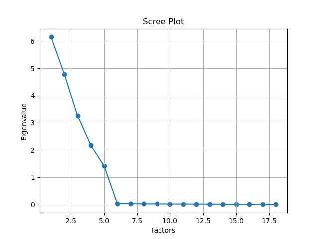

# Assignment 2

Name：Shiqu Wu

Student ID：518021910665

# 1 . 	Principle Component Analysis (PCA)

(1.1)

## PCA algorithms:

- Eigen-decomposition
- Singular Value Decomposition (SVD)
- Generalized Hebbian Algorithm (GHA)
- Oja 
- Least Mean Square Error Root (LMSER)

(1.2)

## SVD:

$$
A=U \Sigma V^T\\
U^TU=I\\
V^TV=I
$$

where $U$ is the eigenvectors of $AA^T$ (1), $V$ is the eigenvectors of $A^TA$ (2) and $\Sigma$ is a diagonal matrix with $r$ elements equal to the root of the positive eigenvalues of $A^TA$ and $AA^T$.

Proof of (1): 
$$
AA^T=U\Sigma V^TV\Sigma U^T, V^TV=I\\
AA^T=U\Sigma^2U^T\\
AA^TU=U\Sigma^2U^TU, U^TU=I\\
AA^TU=U\Sigma^2=\Sigma^2U
$$
Thus, we have $U$ is the eigenvectors of $AA^T$.

Proof of (2):


$$
A^TA=V\Sigma U^TU\Sigma V^T=V\Sigma^2V^T\\
A^TAV=V\Sigma^2V^TV=V\Sigma^2=\Sigma^2V\\
$$
Thus, we have $V$ is the eigenvectors of $A^TA$ . And according to the proof above, we can get $\Sigma$  is a diagonal matrix with $r$ elements equal to the root of the positive eigenvaluess of $A^TA$ and $AA^T$.

First principle component $w_1$:

For $X=\{x_1,x_2,...,x_N\}$, perform SVD we can get: 
$$
X=U\Sigma V^T\\
XV=U\Sigma
$$
Thus, we can know that columns of $U\Sigma$ are principle components of PCA. And $w_1$ is the first row of $U\Sigma$.

(1.3)

## Eigen-decomposition:

According to Mean Square Error (MSE), we define the cost function $J(w)$ as below:
$$
J(w)=\frac{1}{N}\sum_{n=1}^{N}||x_t-(x^Tw)w||^2\\
c.n.\ w^Tw=1
$$
Using Lagrange multiplier we can solve this minimum problem with constraint by:
$$
L(\{x_t\},w)=J(\{x_t\},w)-\lambda (w^Tw-1)\\
\frac{\delta J(w)}{\delta w}-\lambda\frac{\delta(w^Tw-1)}{\delta w}=0\\
\Sigma_x w=-\lambda w
$$
From the result we can see that $w$ is the eigenvectors of $\Sigma_x$, which is the covariance matrix of $X$: $\Sigma_x=\frac{1}{N}\sum_{t=1}^N x_tx_t^T$. Thus, we can know that first principle component $w_1$ is the first row of $w$.

(1.4)

## Generalized Hebbian Algorithm (GHA):

Unlike classical Oja’s rule that extracts only one component at a time Generalized Hebbian algorithm ‘works’ on all the component simultaneously. Basically for every component k, if k != 1, the next x used in the update rule is calculated as follows:
$$
\mathbf{x'} = \textbf{x}-\sum_{k=1}^{j-1} {\mathbf{w_k(n)}}y_k(n)
$$
From the description above we can know that GHA is an adaptive learning rule. The whole algorithm is therefore can be formulated as follows:
$$
y_j(n)=\sum_{i=1}^{m}w_{ji}(n)x_i(n)\\
\Delta(w_{ji}(n)) = \eta (y_j(n)x_i(n)-y_j(n) \sum_{k=1}^j w_{ki}(n) y_k(n)
$$
Generally, the weight vector will ultimately align itself with the direction of greatest variance in the data. The effect of GHA can be seen below:


But note that if the initial $w$ points away from the cluster, the dot product with $x$  will be negative, and $w$ will ultimately point in exactly the opposite direction. This anomaly case is shown below:


The $w(t)$ can be deduced through the following steps:
$$
\Delta \bar w=\eta xx^T\bar w=\eta C \bar w\\
\Sigma=(\bar x-\bar u)(\bar x-\bar u)^T\\
$$
where $C$ is the correlation matrix and $\Sigma$ is the covariance matrix (note that if $\bar u=0$, then $C=\Sigma$).  From a mathematical perspective, this is a discretized version of a linear system of coupled first-order differential equations:
$$
\frac{d\bar w}{dt}=C\bar w\\
\bar w(t)=e^{\lambda t}\bar u
$$
According to the expression we can know that if we wanted to solve this system of equations, we’d still need to solve for both λ and u, which are calculated as follows:
$$
C\bar w =\frac{d\bar w}{dt}\\
C e^{\lambda t}\bar u=\frac{d(e^{\lambda t}\bar u)}{dt}=\lambda e^{\lambda t}\bar u\\
C\bar u=\lambda \bar u
$$
So λ is the eigenvalue of correlation matrix $C$ and $u$ is the corresponding eigenvectors. Thus, we can calculate $w$ by: $\bar w(t)=e^{\lambda t}\bar u$. And first principle component $w_1$ is the first row of $\bar w(t)$.

(1.4)

## Cons and Pros:

- SVD, Eigen Decomposition

  - Pros:

    Not adaptive learning algorithm. So it's faster and simpler to implement.

  - Cons:
    - Not suitable for online learning.
    - Not suitable for big datasets. 

- GHA

  - Pros:

    Looking at one synapse at a time:
    $$
    \Delta(w_{ji}(n)) = \eta (y_j(n)x_i(n)-y_j(n) \sum_{k=1}^j w_{ki}(n) y_k(n)
    $$
    It means that the Hebbian synapse, characterized by a weight $w_{ji}$, is modified as a function of the activity of only local units it connects. 

    For the fact that learning is incremental; that is, a weight update is performed each time the neuron is exposed to a training pattern. Thus, for online learning GHA is better because it allows to process data stream.

  - Cons:

    It takes a lot of time for GHA to converge.

- LMSER

  - Pros:

    Not adaptive learning algorithm.

  - Cons:

    The algorithm can produce complicated dynamical behavior under certain conditions, such as the periodic oscillation, bifurcation and chaos. 

# 2 . 	Factor Analysis (FA)

(2.1)

## Bayesian posterior $p(y|x)$:

As we've known that:
$$
x=Ay+u+e\\
p(x|y)=G(x|Ay+u,\Sigma_e)\\
p(y)=G(y|0,\Sigma_y)
$$
We can calculate bayesian posterior $p(y|x)$ by:
$$
p(y|x)=\frac{p(y)p(x|y)}{p(x|\theta)}=\frac{G(y|0,\Sigma_y)p(x|y)\ G(x|Ay+u,\Sigma_e)}{G(x|u,AA^T+\delta^2\Sigma_e)}
$$
where $p(x|\theta)=G(x|u,AA^T+\delta^2I)$ is deduced by:
$$
p(x|\theta)=
\begin{cases}
\sum p(x|y)p(y)\quad ,discrete\\
\int p(x|y)p(y)dy\quad ,continuous
\end{cases}
=G(x|u,AA^T+\delta^2\Sigma_e)
$$

# 3 . 	Independent Component Analysis (ICA)

(3.1)

## Why maximizing non-Gaussianity:

Non-Gaussianity is of paramount importance in ICA estimation. Without non-Gaussianity the estimation is not possible at all (unless the independent components have time-dependences). Therefore, it is not surprising that non-Gaussianity could be used as a leading principle in ICA estimation. In fact, this approach allows us to derive a highly efficient ICA algorithm: **Fast ICA**, which is a fixed-point algorithm that can be used for estimating the independent components one by one. Here is an intuitive interpretation of this idea:
$$
x=Ay\\
A^{-1}x=y\\
y=W^T x=W^TAs\\
y=z^Ts
$$
where $z^Ts$ has more Gaussian than any of the $s_i$. Thus, we want to find $w$ that maximizes the non-Gaussianity, which can be measured by several ways (Negentropy, Kurtosis, Mutual Information...). 

Another way to understand this idea is to use **Central Limit Theorem** : Average of many independent random variables will have a distribution that is close(r) to gaussian. In other words, multiple independent random variables will tend to form Gaussian distribution after mixing, so we can think that " **the more mixed variables, the stronger the Gaussian**; **the more independent, the weaker the Gaussian**". Therefore, we can use non-Gaussianity to measure the independence between signals.  This is why we try to  find a $w$ that maximizes the non-Gaussianity.

# 4 . 	Dimensionality Reduction by FA

(4.1)

## Factor Analysis:

#### What is FA:

A method to represent observed variables as a linear combination of factors (unobserved variables|| latent variables) and error items. The goodness of the representation is expressed by cumulative variance sum for the factors.

#### How does FA work:

1. Factor Extraction:

   In this step, the number of factors and approach for extraction selected using variance partitioning methods such as PCA and CFA (common factor analysis).

2. Factor Rotation:

   In this step, rotation tries to convert factors into uncorrelated factors — the main goal of this step to **improve the overall interpretability**. There are lots of rotation methods that are available such as: `Varimax rotation method, Quartimax rotation method, and Promax rotation method.`

#### Applying Assumptions:

1. There are no outliers in data.
2. Sample size should be greater than the factor.
3. There should not be perfect multicollinearity.
4. There should not be homoscedasticity between the variables.

#### Types:

- Exploratory FA: Its basic assumption is that any observed variable is directly associated with any factor.
- Confirmatory FA: Its basic assumption is that each factor is associated with a particular set of observed variables.

#### Terminology:

- Factor loadings: A matrix of shape: (#observed variables,#factors), which shows the correlation between them,
- Egien values: A vector of Variance explained each factor from the total variance, which has shape (#factors,)
- Communalities: sum of the squared loadings for each variable

#### FA vs PCA:

- PCA components explain the maximum amount of variance while FA explains the covariance in data.
- PCA components are fully orthogonal to each other whereas FA does not require factors to be orthogonal.
- PCA component is a linear combination of the observed variable while in FA, the observed variables are linear combinations of the unobserved variable or factor.
- PCA components are uninterpretable. In FA, underlying factors are labelable and interpretable.
- PCA is a kind of dimensionality reduction method whereas FA is the latent variable method. --> PCA is a type of FA.

#### Pros and Cons:

- Pros:
  - It compresses the observed variables into a few unobserved variables, which benefits the analysis.
- Cons:
  - Results of factor analysis are controversial. Its interpretations can be debatable because more than one interpretation can be made of the same data factors. The naming of factors requires domain knowledge.

(4.2)

## Experiment Results:

Settings:

- N=100, n=10,m=3,$\delta^2$=0.1,$\mu$=0			(1)
- N=100, n=10,m=4,$\delta^2$=0.1,$\mu$=0			(2)
- N=100, n=15,m=4,$\delta^2$=0.1,$\mu$=0			(3)

- N=100, n=18,m=5,$\delta^2$=0.1,$\mu$=0			(4)
- N=500, n=18,m=5,$\delta^2$=0.1,$\mu$=0			(5)
- N=2000, n=18,m=5,$\delta^2$=0.1,$\mu$=0			(6)

Here I pick several critical experiment settings to illustrate the effects of hyper-parameters through comparison.

#### **Latent dim experiments (1,2,3,4):** 

We can see that the difference between this series of settings is the generated dataset `output dim n` and `latent dim m`. We plot the eigenvalues of the model in each setting and see the differenced.

 **N=100, n=10,m=3,$\delta^2$=0.1,$\mu$=0  (1):**

Best AIC score: -1057.149889577144 		Best m: 3

Best BIC score: -1070.1757405070844 		Best m: 3


**N=100, n=10,m=4,$\delta^2$=0.1,$\mu$=0   (2):**

Best AIC score: -1260.595879468881 		Best m: 4
Best BIC score: -1282.7398260497798 		Best m: 4


**N=100, n=15,m=4,$\delta^2$=0.1,$\mu$=0   (3)**

Best AIC score: -1476.5430884198176 		Best m: 6
Best BIC score: -1503.5575550278209 		Best m: 4


**N=100, n=15,m=5,$\delta^2$=0.1,$\mu$=0   (4)**

Best AIC score: -1773.2806224798933 		Best m: 7
Best BIC score: -1810.3966048399313 		Best m: 5

!

**N=100, n=18,m=5,$\delta^2$=0.1,$\mu$=0   (5)**

Best AIC score: -1881.3600383400135 		Best m: 8
Best BIC score: -1926.2105481049111 		Best m: 6


We can see from the result that the larger the latent dim `m`, we need to set a smaller output dim `n` to get the right result using AIC (otherwise, see (3) is a counterexample, the using the AIC score can't find the correct model). From (1) (3) (4) we can see that using BIC score can find the right model (`best reduced dim` is equal to the original dataset `latent dim`, which means for original dataset's mixed variables, the right FA model finds a set of independent variables to approximately express the original data). 

But if the original dataset's output dim `n` is not small enough (in experiment (5)), using BIC score can't find the correct model, either. However, we can see from the eigenvalue graph that the number of FA components whose eigenvalue is larger than `0.5` is equal to the number of latent variables from input dataset $X$. Thus, **eigenvalue threshold $0.5$** is a better way to select the best FA model than AIC and BIC.

#### Sample number experiments (4,5,6):

  **N=100, n=18,m=5,$\delta^2$=0.1,$\mu$=0  (1):**

Best AIC score: -1881.3600383400135 		Best m: 8
Best BIC score: -1926.2105481049111 		Best m: 6


**N=500, n=18,m=5,$\delta^2$=0.1,$\mu$=0  (5):**

Best AIC score: -9710.098836335868 		Best m: 8
Best BIC score: -9772.048034935186 		Best m: 5



**N=1000, n=18,m=5,$\delta^2$=0.1,$\mu$=0   (6):**

Best AIC score: -19050.695070960035 		Best m: 8
Best BIC score: -19130.111090535054 		Best m: 5


From the comparison we can see that as the number of sample increases, the eigenvalue graph tends to become smoother. And the difference between the largest eigenvalue factor (factor 1) and smallest eigenvalue factor (factor 5) becomes smaller :

- N=100: factor 1: 7.5 ; factor 5:  1.05
- N=500: factor 1: 6.1 ; factor 5:  1.37
- N=1000: factor 1: 5.8 ; factor 5:  1.72

It means that we use threshold method (number of factors that eigenvalue > 0.5 is selected as the best model's reduced dim) is safer. Therefore, we can know that the larger the number of samples, the more robust the FA model results is.  And we can see that the **bad effects of too large output dim $n$ for BIC** can be eliminated by increasing the number of samples. We can see that in  experiment (5), (6) where the number of samples is big enough (**N>=500**), using BIC score can find the best model correctly. 

 (4.3)

#### Implementation code:

   

```python
import numpy as np
import pandas as pd
from sklearn.datasets import load_iris
from factor_analyzer import FactorAnalyzer
from sklearn.decomposition import FactorAnalysis
import matplotlib.pyplot as plt


def data_generation(sample_size=100, output_dim=10, latent_dim=5, covariance=0.1, mu=0., A_scale=10.):
    assert covariance >= 0, "covariance need to be >=0 "
    # randomly sample latent variable y from Gaussian distribution
    y_t = np.random.normal(loc=0., scale=1.0, size=(sample_size, latent_dim))
    print("The shape of y:", y_t.shape)
    # randomly sample error variable e from Gaussian distribution
    e_t = np.random.normal(loc=0., scale=np.sqrt(covariance), size=(sample_size, output_dim))
    print("The shape of e:", e_t.shape)
    # randomly generate A
    A = np.random.normal(loc=0., scale=0.5, size=(latent_dim, output_dim)) * A_scale
    print("The shape of A:", A.shape)
    # construct xt
    x_t = np.add(np.add(np.dot(y_t, A), e_t), np.ones_like(e_t) * mu)
    print("The shape of X:", x_t.shape)
    return x_t


def test_model(n_components):
    fa_egi = FactorAnalyzer(n_factors=n_components, rotation=None)
    fa_egi.fit(X)
    ev, v = fa_egi.get_eigenvalues()
    print("Eigenvalues", ev)
    print("Plotting eigenvalues")
    plotting(ev=ev)
    fa_model = FactorAnalysis(n_components=n_components, random_state=1234)
    fa_model.fit(X)
    score = fa_model.score(X)  # Compute the average log-likelihood of the samples
    params = fa_model.get_params()
    print("Log Likelihood:", score)
    print("Params:", np.shape(params))


def AIC(log_prob, num_params):
    return log_prob - num_params


def BIC(log_prob, num_params, N):
    return log_prob - 0.5 * np.log(N) * num_params


def FA_model(M):
    nc_list = np.arange(1, M)
    aic_max = -10000000
    bic_max = -10000000
    best_m_aic = 0
    best_m_bic = 0
    for n_components in nc_list:
        fa_model = FactorAnalysis(n_components=n_components)
        fa_model.fit(X)
        score = fa_model.score(X)*X.shape[0]  # Compute the average log-likelihood of the samples
        print("n_components:", n_components, "Log Likelihood:", score)
        num_params = latent_dim * n_components + 1
        aic_score = AIC(log_prob=score, num_params=num_params)
        bic_score = BIC(log_prob=score, num_params=num_params, N=sample_size)
        if aic_score > aic_max:
            aic_max = aic_score
            best_m_aic = n_components
        if bic_score > bic_max:
            bic_max = bic_score
            best_m_bic = n_components
        print("AIC score:", aic_score, "BIC score:", bic_score, "\n")
    print("Best AIC score:", aic_max, "Best m:", best_m_aic)
    print("Best BIC score:", bic_max, "Best m:", best_m_bic)


def plotting(ev):
    # Create scree plot using matplotlib
    plt.scatter(range(1, X.shape[1] + 1), ev)
    plt.plot(range(1, X.shape[1] + 1), ev)
    plt.title('Scree Plot')
    plt.xlabel('Factors')
    plt.ylabel('Eigenvalue')
    plt.grid()
    plt.show()


if __name__ == '__main__':
    sample_size = 1000      # AIC 可以找到： sample_size=500, output_dim=10, latent_dim=3
    output_dim = 18
    latent_dim = 5
    covariance = 0.1
    mu = 0
    A_scale = 3
    M = output_dim
    
    X = data_generation(sample_size=sample_size, output_dim=output_dim, latent_dim=latent_dim, covariance=covariance,
                        mu=mu, A_scale=A_scale)
    test_model(n_components=latent_dim)
    FA_model(M)


```

