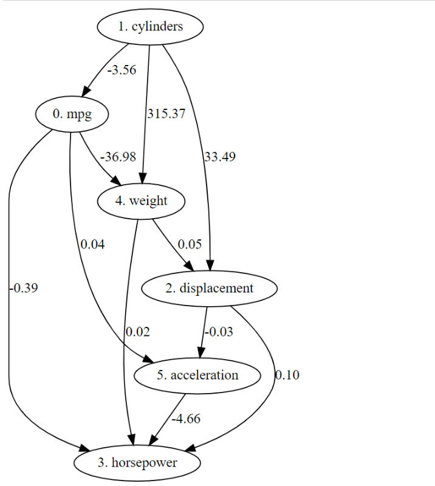

# Assignment 3

Name：Shiqu Wu

Student ID：518021910665

# 1 . 	SVM vs Neural Network

(1.1)

## Dataset

We choose the `w6a`and `a9a` dataset from https://www.csie.ntu.edu.tw/~cjlin/libsvmtools/datasets/. 

**a9a:**

Data train size:  (32561,)
Data train example: 

X: {5: 1.0, 7: 1.0, 14: 1.0, 19: 1.0, 39: 1.0, 40: 1.0, 51: 1.0, 63: 1.0, 67: 1.0, 73: 1.0, 74: 1.0, 76: 1.0, 78: 1.0, 83: 1.0}

Y:  -1.0
Data test size: (16281,) 
Data test example: 

X: {1: 1.0, 6: 1.0, 17: 1.0, 21: 1.0, 35: 1.0, 42: 1.0, 54: 1.0, 62: 1.0, 71: 1.0, 73: 1.0, 74: 1.0, 76: 1.0, 80: 1.0, 83: 1.0}

Y:  -1.0
One hot vector length: 123
Sklearn data shape: 

X-train:  (32561, 123)  		Y-train (32561,)  		X-test: (16281, 123)  		Y-test: (16281,)

**w6a:**

Data train size: (17188,) 
Data train example:

X:  {41: 1.0, 54: 1.0, 117: 1.0, 250: 1.0} 

Y:  -1.0
Data test size: (32561,)
Data test example: 

X:  {59: 1.0, 68: 1.0, 115: 1.0} 

Y:  -1.0
One hot vector length: 300
Sklearn data shape: 

X-train:  (17188, 300) 		Y-train:  (17188,) 		X-test:  (32561, 300) 		Y-test:  (32561,)

(1.2)

## SVM

Generally we prefer to use SVM implementation in `sklearn` library due to its wide popularity. But this time I decided to try something new and use this new tool: `libsvm` to solve the binary classification problem. This is what I found on the Internet about its usage rules, I sorted it out and presented it as follows:

**Install:**
pip install libsvm
**Hyper-parameters:**
-s  svm类型：SVM设置类型(默认0)
    0 -- C-SVC
    1 -- v-SVC
    2–一类SVM
    3 -- e -SVR
    4 -- v-SVR
-t  核函数类型：核函数设置类型(默认2)
    0–线性：u'v
    1–多项式：(r*u'v + coef0)^degree
    2–RBF函数：exp(-gamma|u-v|^2)
    3–sigmoid：tanh(r*u'v + coef0)
-d degree：核函数中的degree设置(针对多项式核函数)(默认3)
-g r(gama)：核函数中的gamma函数设置(针对多项式/rbf/sigmoid核函数)(默认1/ k)
-r coef0：核函数中的coef0设置(针对多项式/sigmoid核函数)((默认0)
-c cost：设置C-SVC，e -SVR和v-SVR的参数(损失函数)(默认1)
-n nu：设置v-SVC，一类SVM和v- SVR的参数(默认0.5)
-p p：设置e -SVR中损失函数p的值(默认0.1)
-m cachesize：设置cache内存大小，以MB为单位(默认40)
-e eps：设置允许的终止判据(默认0.001)
-h shrinking：是否使用启发式，0或1(默认1)
-wi weight：设置第几类的参数C为weight*C(C-SVC中的C)(默认1)
-v n: n-fold交互检验模式，n为fold的个数，必须大于等于2
其中-g选项中的k是指输入数据中的属性数。option -v随机地将数据剖分为n部
**Note:**
1）如果你要输出类的概率，一定要有-b参数. -b:0  simple mode;  -b:1  complex mode
    complex mode 下，显示每轮optimization的结果：
    optimization parameters:
    rho 为判决函数的常数项b#iter为迭代次数，
    nu 与前面的操作参数-n n 相同，
    obj为SVM文件转换为的二次规划求解得到的最小值
    nSV 为支持向量个数，
    nBSV为边界上的支持向量个数
    Total nSV为支持向量总个数
2）C一般可以选择为：10^t , t=- 4..4就是0.0001到10000.选择的越大，表示对错误例惩罚程度越大，可能会导致模型过拟合
3) -t用来指定核函数类型（默认值是2）

**svmutil.svm_predict:**

In svmutil.svm_predict(yt, xt, model), if you want to set options, you need to set the model parameters first return values:

- p_labels: a list of predicted labels
- p_acc: a tuple including accuracy (for classification), mean squared error, and squared correlation coefficient
- p_val：a list of decision values or probability estimates

(1.3)

## MLP (Multi-Layer Perceptrons)

We get used to build a neural network using `Pytorch` framework or `	Tensorflow` framework. For the fact that it's convenient and flexible to solve most of the problems. I've also try to build a neural network from scratch (including implement the forward propagation and backward propagation) to clearly see what it really does during the whole training process.  And in this assignment, we have access to a new tool : `sklearn.neural_network`. It has simple function interface and it's easy to understand compared with `libsvm` tool. 

```python
MLPClassifier(solver='adam', hidden_layer_sizes=(first_layer_units[i], second_layer_units[i]),random_state=1, max_iter=5000,verbose=False, activation='relu', batch_size=128, learning_rate_init=0.0001)
```

- solver:   adam, lbfgs , sgd 		--> Use most advanced optimizer: adam
- hidden_layer_sizes:  the `ith ` element represents the number of neurons in the `ith` hidden layer
- max_iter:  For stochastic solvers ('sgd', 'adam'), it determines the number of epochs, not the number of gradient steps.

(1.4)

## Experiments

## I. a9a

#### Libsvm:

Hyper-parameters C (penalty factor):   

```python
model = svmutil.svm_train(Y_train, X_train, '-s 0 -t 2 -c %f -h 0' % C_value)
```

Setting 1: range:  `[0.1, 5.0]`


Setting 2: range:  `[5.0, 30.0]`


From **Setting 1** we can see that as the regularization parameter C increases, the test accuracy gradually increases. This is due to the smoothness of SVM model 's decision boundary. When C is small, the SVM model overfits the training set (the decision boundary walks wiggly through the support vectors). Overfitting decreases the general ability of the model.  So it's not wield that the model's performance on test set is bad. However, the penalty can't be too large. As we can see in **Setting 2**  when C is too large (larger than `23`) the model's performance on test set starts to drop down. For the fact that the decision boundary is too straight that it under-fits the dataset, which results in high-bias problem. So we set `C=17` and achieved an accuracy of `85.125`.

#### MLP:

**Main idea:**  First we set the MLP `max_iter` parameter a big number (e.g. 8000)  to ensure that all kinds of network settings can converge. Then we see different model's performance on training set and test set:

-  Low accuracy in training set: 

  High bias, need a larger network scale (increase each layer's unit number or increase the number of layers).

-  High accuracy in training set while low accuracy in test set:

  High variance, the network is large enough and it overfits the training set. Need to reduce the number of epochs or decrease the network scale.

In this way, we can choose a feasible network scale that has a relatively good training set performance. After that, we fine-tune the model to search for the best training epochs. Here are the results:

**Select network scale:**  (each setting is trained for `8000` epochs)


Using the strategy we've described above, we select the `L1: 128, L2:4 ` as the network scale. Then we apply fine-tuning on this setting.

**Fine-tuning**

Setting 1: epoch range: `[100, 2000]`


Setting 2: epoch range: `[5, 100]`


From the accuracy graph we can see that the best training epoch for current model scale is `epoch=45` and it reaches an accuracy of `85.29`.

## II. w6a

#### Libsvm:

Hyper-parameters C (penalty factor):   

```python
model = svmutil.svm_train(Y_train, X_train, '-s 0 -t 2 -c %f -h 0' % C_value)
```

Setting 1: range:  `[5.0, 30.0]`


Setting 2: range:  `[30.0, 55.0]`


From **Setting 1** we can see that as the regularization parameter C increases, the test accuracy gradually increases. This is due to the smoothness of SVM model 's decision boundary. When C is small, the SVM model overfits the training set (the decision boundary walks wiggly through the support vectors). Overfitting decreases the general ability of the model.  So it's not wield that the model's performance on test set is bad. However, the penalty can't be too large. As we can see in **Setting 2**  when C is too large (larger than `51`) the model's performance on test set starts to drop down. For the fact that the decision boundary is too straight that it under-fits the dataset, which results in high-bias problem. So we set `C=50.5` and achieved an accuracy of `98.68`.

#### MLP:

**Select network scale:**  (each setting is trained for `8000` epochs)


Using the strategy we've described above, we select the `L1: 64, L2:4 ` as the network scale. Then we apply fine-tuning on this setting.

**Fine-tuning**

Setting 1: epoch range: `[100, 2000]`


Setting 2: epoch range: `[5, 100]`


From the accuracy graph we can see that the best training epoch for current model scale is `epoch=60` and it reaches an accuracy of `98.80`.

# 2 . 	Causal Discovery

(2.1)

## Basic knowledge


**What is causal discovery:**

Causal Structure Discovery (CSD) is the problem of identifying causal relationships from large quantities of data through computational methods. 

**Why we need it:**

In the digital age in which we live, scientists are collecting huge amounts of data, but making sense of all of it is a major challenge.  Because experiments are often costly and sometimes impossible or unethical to perform. For instance, in policy-making, one may want to predict *"the effect on a population health status"* of *"forbidding to smoke in public places"*, before passing a law. This example illustrates the case of an experiment, which is possible, but expensive. Forcing people to smoke would constitute an unethical experiment. Often the task is to extract as much causal knowledge as possible from such data. However, traditional association-based computational methods has limited ability of discovering causal relationships.  That's why the causal discovery algorithms come into rescue. Based on the existing dataset, causal networks can help scientists decide which experiment to perform next. The results of newly performed experiments can be combined with the original data to create a dataset that in turn is used to generate new causal networks.  

Note: More details about the [Motivation of Causal Discovery](http://www.causality.inf.ethz.ch/home.php)

**Algorithms:**

- Directed Graphical Causal Models

  A DGCM has the following components: (1) a set of variables, regarded as “random variables," (2) a set of directed edges between pairs of variables, each edge regarded as the hypothesis that the two variables would be associated if all other variables were fixed at some values while the tail variable is exogenously varied, and (3) a joint probability distribution over the possible values of all of the variables. 

- Traditional Constraint-Based and Score-Based Causal Discovery Methods

  - PC algorithm:

    One of the oldest algorithms that is consistent under i.i.d. sampling assuming no latent confounders.  It works in the following steps:

    

    **(A)** Original true causal graph. **(B)** PC starts with a fully-connected undirected graph. **(C)** The *X* − *Y* edge is removed because *X* ⫫ *Y*. **(D)** The *X* − *W* and *Y* − *W* edges are removed because *X* ⫫ *W* | *Z* and *Y* ⫫ *W* | *Z*. **(E)** After finding v-structures. **(F)** After orientation propagation.

  - FCI algorithm:

    One of the most important generalization of PC algorithm is the Fast Causal Inference (FCI) Algorithm. Here is how it determines the existence of latent confunders:

    

    **(A)** Original true causal graph. **(B)** After edges are removed because of conditional independence relations. **(C)** The output of FCI, indicating that there is at least one unmeasured confounder of *Y* and *Z*.

  - GES algorithm:

    Instead of beginning with a complete undirected graph, as in PC and FCI, the Greedy Equivalence Search (GES) starts with an empty graph, and adds currently needed edges, and then eliminates unnecessary edges in a pattern. At each step in the algorithm as decision is made as to whether adding a directed edge to the graph will increase fit measured by some quasi-Bayesian score such as BIC, or even by the *Z* score of a statistical hypothesis test, the edge that most improves fit is added. The resulting model is then mapped to the corresponding Markov equivalence class, and the procedure continued. When the score can no longer be improved, the GES algorithm then asks, edge by edge, which edge removal, if any, will most improve the score, until no further edges can thus be removed.

- Non-Gaussian or Non-linear Methods Based on Functional Causal Models

  - LiNGAM

    LiNGAM was one of the first of the algorithms that assumed linearity among the variables and non-Gaussianity of error term, and still one of the best for smaller models. The idea is to use the Independent Components Analysis (ICA) algorithm to check all permutations of the variables to find one that is a causal order—that is, one in which earlier variables can cause later variables but not vice-versa.

(2.2)

## LiNGAM


LiNGAM represents the Linear, Non-Gaussian, Acyclic Model which assigns linear function values to each variable $x_i$. The linear equation can be written as below:
$$
x_i=\sum_{k(j)<k(i)} b_{ij}x_j+e_i+c_i
$$
where $k(i)$ is the causal order of variable $x_i$ , $e_i$ is the disturbance term which contains all continuous-valued random variables with non-Gaussian distributions of non-zero variances and it satisfies $p(e_1,e_2,...e_m)=\prod_i p_i(e_i)$. The constant item $c_i$ is optional in this case. Here is the executing process of LiNGAM algorithm:

1. For input matrix $X_{m*n}$, first subtract  the mean from each row of $X$, then apply an **ICA algorithm** to obtain a decomposition $X = AS$ where $S$ has the same size as X and contains in its rows the independent components.  We can represent $W$ as $W=A^{-1}$

2. Find the one and only permutation of rows of $W$ which yields a matrix $\bar W$ without any zeros on the main diagonal.

3. Divide each row of $\bar W$  by its corresponding diagonal element, to yield a new matrix $\bar W'$ with all ones on the diagonal. Then compute an estimate $\hat B$ of $B$ by:
   $$
   \hat B=I-\bar W'
   $$

4. Find the permutation matrix $P$ of $\hat B$ which yield a matrix:
   $$
   \bar B=P\hat B P^{T}
   $$
   which is as close as possible to strictly lower triangular. This can be measured for instance using $\sum_{i\leq j} \bar B_{ij}^2$.

(2.3)

## Experiment


**Dataset:**

The dataset I choose to use for this experiment is the [**Auto MPG Data Set**](http://archive.ics.uci.edu/ml/datasets/Auto+MPG).  This dataset was taken from the StatLib library that concerns city-cycle fuel consumption in miles per gallon, to be predicted in terms of 3 multivalued discrete and 5 continuous attributes. It has 9 attributes which are:

1. mpg: continuous. This is the target attribute which means Miles Per Gallon which reflects a car's fuel consumption ability

2. cylinders: multi-valued discrete

3. displacement: continuous

4. horsepower: continuous

5. weight: continuous

6. acceleration: continuous

7. model year: multi-valued discrete

8. origin: multi-valued discrete

9. car name: string (unique for each instance) 

Here is the input data X after doing the preprocessing (we drop 3 attributes that are irrelevant and delete the missing value) :


After applying the LiNGAM algorithm, the result is shown as below:




From the result we can see that some of the edges are correct, like the `cylinder` is the cause of `weight` and the cause of `mpg`. For the fact that a large cylinder which supplies large power needs a high fuel consumption ( there is a negative correlation between mpg and fuel consumption) and it's more heavier.  However, there are some wrong edges like `acceleration` is the cause of `horsepower` and `mpg` is the cause of `horsepower` which are not reasonable. As we all know, horsepower should be the cause of acceleration and fuel consumption. Also, `mpg` can't be the cause of `weight` as what you can see in the figure. These relationships are inversed or wrong. Those unreasonable directions show that LiNGAM is not so good. But it can still found some cause-result relationships. 


# 3 .  Appendix

**SVM vs Neural Network**

```python
from libsvm import svm, svmutil, commonutil
import numpy as np
import matplotlib.pyplot as plt
import time
from sklearn.neural_network import MLPClassifier


def load_data(train_path, test_path):
    y_train, x_train = commonutil.svm_read_problem(train_path)
    y_test, x_test = commonutil.svm_read_problem(test_path)
    print("Data train size:", np.shape(x_train), np.shape(y_train))
    print("Data train example:", x_train[0], y_train[0])
    print("Data test size:", np.shape(x_test), np.shape(y_test))
    print("Data test example:", x_test[0], y_test[0])
    return x_train, y_train, x_test, y_test


def convert_data(x_train, y_train, x_test, y_test):
    """
    convert the libsvm data style to sklearn data style: X:(n_samples,n_features), Y: (n_samples,)
    key max: 123, key min: 1
    We convert to one-hot encoding
    """
    # get one hot vector size
    one_hot_len = max([max(i.keys()) for i in x_train if i])
    print("One hot vector length:", one_hot_len)
    sk_x_train = np.zeros(shape=(np.shape(x_train)[0], one_hot_len))
    sk_y_train = np.array(y_train)  # np.array() and np.asarray: the former copies object by default
    sk_x_test = np.zeros(shape=(np.shape(x_test)[0], one_hot_len))
    sk_y_test = np.array(y_test)
    for row in range(np.shape(x_train)[0]):
        d = x_train[row]
        for k in d.keys():
            sk_x_train[row, k - 1] = 1
    for row in range(np.shape(x_test)[0]):
        d = x_test[row]
        for k in d.keys():
            sk_x_test[row, k - 1] = 1
    print("Sklearn data shape:", np.shape(sk_x_train), np.shape(sk_y_train), np.shape(sk_x_test), np.shape(sk_y_test))
    return sk_x_train, sk_y_train, sk_x_test, sk_y_test


def svm_train_and_test():
    # train and test
    model = svmutil.svm_train(Y_train, X_train, '-s 0 -t 2 -c 4 -h 0')  # -h 1: 69s ; -h 0: 67s
    print("Model Hyper-Parameters:\n", model.param)
    p_label, p_acc, p_val = svmutil.svm_predict(Y_test, X_test, model)
    print('\n', "Predicted Labels:", np.array(p_label))
    print("True Labels:", Y_test)
    print(' Probability estimate Values:', p_val)


def svm_hyper_parameters_tuning(X_train,Y_train,X_test,Y_test):
    # C_list = np.linspace(0.01, 0.1, 100)
    # Tick_list = np.round(np.linspace(0.01, 0.11, 26), decimals=2)
    # C_list = np.linspace(0.1, 5.0, 50)
    # Tick_list = np.linspace(0.1, 5.0, 26)
    C_list = np.linspace(30.0, 55.0, 50)
    Tick_list = np.linspace(30.0, 55.0, 26)
    
    acc_list = []  # accuracy (for classification)
    mse_list = []  # mean squared error
    scc_list = []  # squared correlation coefficient
    for C_value in C_list:
        model = svmutil.svm_train(Y_train, X_train, '-s 0 -t 2 -c %f -h 0' % C_value)
        p_label, p_acc, p_val = svmutil.svm_predict(Y_test, X_test, model)
        print("C:", C_value, " Acc:", p_acc)
        acc_list.append(p_acc[0])
        mse_list.append(p_acc[1])
        scc_list.append(p_acc[2])
    
    plt.figure(figsize=(20, 10))
    plt.plot(C_list, acc_list)
    plt.xticks(Tick_list, fontsize=15)
    plt.yticks(fontsize=18)
    plt.xlabel("Regularization Hyper parameter C", fontdict={'size': 18})
    plt.ylabel("Accuracy", fontdict={'size': 18})
    plt.show()
    
    plt.figure(figsize=(20, 10))
    plt.plot(C_list, mse_list)
    plt.xticks(Tick_list, fontsize=15)
    plt.yticks(fontsize=18)
    plt.xlabel("Regularization Hyper parameter C", fontdict={'size': 18})
    plt.ylabel("Mean Squared Error", fontdict={'size': 18})
    plt.show()
    
    plt.figure(figsize=(20, 10))
    plt.plot(C_list, scc_list)
    plt.xticks(Tick_list, fontsize=15)
    plt.yticks(fontsize=18)
    plt.xlabel("Regularization Hyper parameter C", fontdict={'size': 18})
    plt.ylabel("Squared Correlation Coefficient", fontdict={'size': 18})
    plt.show()


def mlp_train_and_test():
    """
     Note: in adam, lbfgs, max_iter is the number of epochs, not max_iterations
     Max iter: 15000    --> 确保网络能训练到收敛，若训练集上精度不高则是high bias，需要大的网络规模，若是test set 上精度不高，则是high
     variance， 此时网络已经够大了，需要调整epoch
    """
    # clf = MLPClassifier(solver='lbfgs', alpha=1e-5, hidden_layer_sizes=(128, 64, 32), random_state=1, max_iter=300,
    #                     verbose=False, activation='relu',batch_size=64)
    clf = MLPClassifier(solver='adam', hidden_layer_sizes=(128, 4), random_state=1, max_iter=500,
                        verbose=False, activation='relu', batch_size=128, learning_rate_init=0.0001)
    clf.fit(X=sk_X_train, y=sk_Y_train)
    print("clf train score:", clf.score(sk_X_train, sk_Y_train))
    print("clf test score:", clf.score(sk_X_test, sk_Y_test))


def mlp_hyper_parameters_tuning(sk_X_train, sk_Y_train, sk_X_test, sk_Y_test):
    Epoch_list = np.arange(5, 100, 5)
    first_layer_units = [8, 16, 16, 32, 32, 64, 64, 128, 128, 128]
    second_layer_units = [2, 4, 8, 4, 8, 4, 8, 2, 4, 8]
    epoch_train_acc_list = []  # accuracy (for classification)
    epoch_test_acc_list = []
    net_train_acc_list = []  # accuracy (for classification)
    net_test_acc_list = []
    for i in range(len(first_layer_units)):
        print("L1:", first_layer_units[i], "L2:", second_layer_units[i])
        clf = MLPClassifier(solver='adam', hidden_layer_sizes=(first_layer_units[i], second_layer_units[i]),
                            random_state=1, max_iter=5000,
                            verbose=False, activation='relu', batch_size=128, learning_rate_init=0.0001)
        clf.fit(X=sk_X_train, y=sk_Y_train)
        train_acc = clf.score(sk_X_train, sk_Y_train)
        test_acc = clf.score(sk_X_test, sk_Y_test)
        print("clf train score:", train_acc)
        print("clf test score:", test_acc)
        net_train_acc_list.append(train_acc)
        net_test_acc_list.append(test_acc)
    
    for epoch in Epoch_list:
        print("Epoch:", epoch)
        clf = MLPClassifier(solver='adam', hidden_layer_sizes=(64, 4), random_state=1, max_iter=int(epoch),
                            verbose=False, activation='relu', batch_size=128, learning_rate_init=0.0001)
        clf.fit(X=sk_X_train, y=sk_Y_train)
        train_acc = clf.score(sk_X_train, sk_Y_train)
        test_acc = clf.score(sk_X_test, sk_Y_test)
        print("clf train score:", train_acc)
        print("clf test score:", test_acc)
        epoch_train_acc_list.append(train_acc)
        epoch_test_acc_list.append(test_acc)
    
    # Network size
    plt.figure(figsize=(16, 8))
    plt.plot(np.arange(len(net_train_acc_list)), net_train_acc_list)
    plt.plot(np.arange(len(net_test_acc_list)), net_test_acc_list)
    plt.xticks(ticks=np.arange(len(first_layer_units)),
               labels=[("L1:" + str(first_layer_units[j]) + " L2:" + str(second_layer_units[j])) for j in
                       range(len(first_layer_units))], fontsize=12)
    plt.yticks(fontsize=18)
    plt.xlabel("Settings", fontdict={'size': 18})
    plt.ylabel("Accuracy", fontdict={'size': 18})
    plt.title("Hyper parameter network size", fontdict={'size': 18})
    plt.legend(["Train acc", "Test acc"], fontsize=18)
    plt.show()
    
    # Epoches
    plt.figure(figsize=(16, 8))
    plt.plot(Epoch_list, epoch_train_acc_list)
    plt.plot(Epoch_list, epoch_test_acc_list)
    plt.xticks(fontsize=15)
    plt.yticks(fontsize=18)
    plt.xlabel("Epoches", fontdict={'size': 18})
    plt.ylabel("Accuracy", fontdict={'size': 18})
    plt.title("Hyper parameter epoch graph", fontdict={'size': 18})
    plt.legend(["Train acc", "Test acc"], fontsize=18)
    plt.show()


if __name__ == '__main__':
    w6a_train_path = r'D:\Google_Download\Machine_Learning\Assignments\Assignment3\Classifications_SVM_MLP\data\w6a\w6a_train.txt'
    w6a_test_path = r'D:\Google_Download\Machine_Learning\Assignments\Assignment3\Classifications_SVM_MLP\data\w6a\w6a_test.txt'
    a9a_train_path = r'D:\Google_Download\Machine_Learning\Assignments\Assignment3\Classifications_SVM_MLP\data\a9a\a9a_train.txt'
    a9a_test_path = r'D:\Google_Download\Machine_Learning\Assignments\Assignment3\Classifications_SVM_MLP\data\a9a\a9a_test.txt'
    t1 = time.time()
    
    # a9a dataset
    X_train, Y_train, X_test, Y_test = load_data(a9a_train_path, a9a_test_path)
    sk_X_train, sk_Y_train, sk_X_test, sk_Y_test = convert_data(X_train, Y_train, X_test, Y_test)
    svm_train_and_test()
    svm_hyper_parameters_tuning(X_train, Y_train, X_test, Y_test)
    mlp_train_and_test()
    mlp_hyper_parameters_tuning(sk_X_train, sk_Y_train, sk_X_test, sk_Y_test)
    
    # w6a dataset
    X_train_2, Y_train_2, X_test_2, Y_test_2 = load_data(w6a_train_path, w6a_test_path)
    sk_X_train_2, sk_Y_train_2, sk_X_test_2, sk_Y_test_2 = convert_data(X_train_2, Y_train_2, X_test_2, Y_test_2)
    svm_train_and_test()
    svm_hyper_parameters_tuning(X_train_2, Y_train_2, X_test_2, Y_test_2)
    mlp_train_and_test()
    mlp_hyper_parameters_tuning(sk_X_train_2, sk_Y_train_2, sk_X_test_2, sk_Y_test_2)
    
    print("Training time:", time.time() - t1)

```

**Causal Discovery**

```python
import numpy as np
import pandas as pd
import graphviz
import lingam
from sklearn.linear_model import LassoCV
import lightgbm as lgb


np.set_printoptions(precision=3, suppress=True)
np.random.seed(0)


def make_graph(adjacency_matrix, labels=None):
    idx = np.abs(adjacency_matrix) > 0.01
    dirs = np.where(idx)
    d = graphviz.Digraph(engine='dot')
    names = labels if labels else [f'x{i}' for i in range(len(adjacency_matrix))]
    for to, from_, coef in zip(dirs[0], dirs[1], adjacency_matrix[idx]):
        d.edge(names[from_], names[to], label=f'{coef:.2f}')
    return d


if __name__ == '__main__':
    print([np.__version__, pd.__version__, graphviz.__version__, lingam.__version__])
    X = pd.read_csv('http://archive.ics.uci.edu/ml/machine-learning-databases/auto-mpg/auto-mpg.data-original',
                    delim_whitespace=True, header=None,
                    names=['mpg', 'cylinders', 'displacement',
                           'horsepower', 'weight', 'acceleration',
                           'model year', 'origin', 'car name'])
    X.dropna(inplace=True)
    X.drop(['model year', 'origin', 'car name'], axis=1, inplace=True)
    print(X.shape)
    print(X.head())
    # causal discovery
    model = lingam.DirectLiNGAM()
    model.fit(X)
    labels = [f'{i}. {col}' for i, col in enumerate(X.columns)]
    d=make_graph(model.adjacency_matrix_, labels)
    # train the model
    target = 0  # mpg
    features = [i for i in range(X.shape[1]) if i != target]
    reg = lgb.LGBMRegressor(random_state=0)
    reg.fit(X.iloc[:, features], X.iloc[:, target])
    # identification of feature influence on model

    ce = lingam.CausalEffect(model)
    effects = ce.estimate_effects_on_prediction(X, target, reg)

    df_effects = pd.DataFrame()
    df_effects['feature'] = X.columns
    df_effects['effect_plus'] = effects[:, 0]
    df_effects['effect_minus'] = effects[:, 1]
    print(df_effects)
    max_index = np.unravel_index(np.argmax(effects), effects.shape)
    print(X.columns[max_index[0]])
    
    print("Training process finished. Congratulations, sir!")
```

