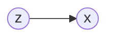

[TOC]

# Mathematical Basis

## 对概率的阐述

对概率的诠释有两大学派，一种是频率派另一种是贝叶斯派。后面我们对观测集采用下面记号：
$$
X_{N\times p}=(x_{1},x_{2},\cdots,x_{N})^{T},x_{i}=(x_{i1},x_{i2},\cdots,x_{ip})^{T}
$$
 这个记号表示有 $N$ 个样本，每个样本都是 $p$ 维向量。其中每个观测都是由 $p(x|\theta)$ 生成的。

### 频率派的观点

$p(x|\theta)$中的 $\theta$ 是一个常量。对于 $N$ 个观测来说观测集的概率为 $p(X|\theta)\mathop{=}\limits _{iid}\prod\limits _{i=1}^{N}p(x_{i}|\theta))$ 。为了求 $\theta$ 的大小，我们采用最大对数似然MLE的方法：

$$
\theta_{MLE}=\mathop{argmax}\limits _{\theta}\log p(X|\theta)\mathop{=}\limits _{iid}\mathop{argmax}\limits _{\theta}\sum\limits _{i=1}^{N}\log p(x_{i}|\theta)
$$

### 贝叶斯派的观点

贝叶斯派认为 $p(x|\theta)$ 中的 $\theta$ 不是一个常量。这个 $\theta$ 满足一个预设的先验的分布 $\theta\sim p(\theta)$ 。于是根据贝叶斯定理依赖观测集参数的后验可以写成：

$$
p(\theta|X)=\frac{p(X|\theta)\cdot p(\theta)}{p(X)}=\frac{p(X|\theta)\cdot p(\theta)}{\int\limits _{\theta}p(X|\theta)\cdot p(\theta)d\theta}
$$
为了求 $\theta$ 的值，我们要最大化这个参数后验MAP：

$$
\theta_{MAP}=\mathop{argmax}\limits _{\theta}p(\theta|X)=\mathop{argmax}\limits _{\theta}p(X|\theta)\cdot p(\theta)
$$
其中第二个等号是由于分母和 $\theta$ 没有关系。求解这个 $\theta$ 值后计算$\frac{p(X|\theta)\cdot p(\theta)}{\int\limits _{\theta}p(X|\theta)\cdot p(\theta)d\theta}$ ，就得到了参数的后验概率。其中 $p(X|\theta)$ 叫似然，是我们的模型分布。得到了参数的后验分布后，我们可以将这个分布用于预测贝叶斯预测：
$$
p(x_{new}|X)=\int\limits _{\theta}p(x_{new}|\theta)\cdot p(\theta|X)d\theta
$$
 其中积分中的被乘数是模型，乘数是后验分布。

## 高斯分布

### 一维情况 MLE

高斯分布在机器学习中占有举足轻重的作用。在 MLE 方法中：

$$
\theta=(\mu,\Sigma)=(\mu,\sigma^{2}),\theta_{MLE}=\mathop{argmax}\limits _{\theta}\log p(X|\theta)\mathop{=}\limits _{iid}\mathop{argmax}\limits _{\theta}\sum\limits _{i=1}^{N}\log p(x_{i}|\theta)
$$
一般地，高斯分布的概率密度函数PDF写为：

$$
p(x|\mu,\Sigma)=\frac{1}{(2\pi)^{p/2}|\Sigma|^{1/2}}e^{-\frac{1}{2}(x-\mu)^{T}\Sigma^{-1}(x-\mu)}
$$
带入 MLE 中我们考虑一维的情况

$$
\log p(X|\theta)=\sum\limits _{i=1}^{N}\log p(x_{i}|\theta)=\sum\limits _{i=1}^{N}\log\frac{1}{\sqrt{2\pi}\sigma}\exp(-(x_{i}-\mu)^{2}/2\sigma^{2})
$$
首先对 $\mu$ 的极值可以得到 ：
$$
\mu_{MLE}=\mathop{argmax}\limits _{\mu}\log p(X|\theta)=\mathop{argmax}\limits _{\mu}\sum\limits _{i=1}^{N}(x_{i}-\mu)^{2}
$$
 于是：
$$
\frac{\partial}{\partial\mu}\sum\limits _{i=1}^{N}(x_{i}-\mu)^{2}=0\longrightarrow\mu_{MLE}=\frac{1}{N}\sum\limits _{i=1}^{N}x_{i}
$$
其次对 $\theta$ 中的另一个参数 $\sigma$ ，有：
$$
\begin{align}
\sigma_{MLE}=\mathop{argmax}\limits _{\sigma}\log p(X|\theta)&=\mathop{argmax}\limits _{\sigma}\sum\limits _{i=1}^{N}[-\log\sigma-\frac{1}{2\sigma^{2}}(x_{i}-\mu)^{2}]\nonumber\\
&=\mathop{argmin}\limits _{\sigma}\sum\limits _{i=1}^{N}[\log\sigma+\frac{1}{2\sigma^{2}}(x_{i}-\mu)^{2}]
\end{align}
$$
于是：
$$
\frac{\partial}{\partial\sigma}\sum\limits _{i=1}^{N}[\log\sigma+\frac{1}{2\sigma^{2}}(x_{i}-\mu)^{2}]=0\longrightarrow\sigma_{MLE}^{2}=\frac{1}{N}\sum\limits _{i=1}^{N}(x_{i}-\mu)^{2}
$$
值得注意的是，上面的推导中，首先对 $\mu$ 求 MLE， 然后利用这个结果求 $\sigma_{MLE}$ ，因此可以预期的是对数据集求期望时 $\mathbb{E}_{\mathcal{D}}[\mu_{MLE}]$ 是无偏差的：
$$
\mathbb{E}_{\mathcal{D}}[\mu_{MLE}]=\mathbb{E}_{\mathcal{D}}[\frac{1}{N}\sum\limits _{i=1}^{N}x_{i}]=\frac{1}{N}\sum\limits _{i=1}^{N}\mathbb{E}_{\mathcal{D}}[x_{i}]=\mu
$$
但是当对 $\sigma_{MLE}$ 求期望的时候由于使用了单个数据集的 $\mu_{MLE}$，因此对所有数据集求期望的时候我们会发现 $\sigma_{MLE}$ 是有偏的：

$$
\begin{align}
\mathbb{E}_{\mathcal{D}}[\sigma_{MLE}^{2}]&=\mathbb{E}_{\mathcal{D}}[\frac{1}{N}\sum\limits _{i=1}^{N}(x_{i}-\mu_{MLE})^{2}]=\mathbb{E}_{\mathcal{D}}[\frac{1}{N}\sum\limits _{i=1}^{N}(x_{i}^{2}-2x_{i}\mu_{MLE}+\mu_{MLE}^{2})\nonumber
\\&=\mathbb{E}_{\mathcal{D}}[\frac{1}{N}\sum\limits _{i=1}^{N}x_{i}^{2}-\mu_{MLE}^{2}]=\mathbb{E}_{\mathcal{D}}[\frac{1}{N}\sum\limits _{i=1}^{N}x_{i}^{2}-\mu^{2}+\mu^{2}-\mu_{MLE}^{2}]\nonumber\\
&= \mathbb{E}_{\mathcal{D}}[\frac{1}{N}\sum\limits _{i=1}^{N}x_{i}^{2}-\mu^{2}]-\mathbb{E}_{\mathcal{D}}[\mu_{MLE}^{2}-\mu^{2}]=\sigma^{2}-(\mathbb{E}_{\mathcal{D}}[\mu_{MLE}^{2}]-\mu^{2})\nonumber\\&=\sigma^{2}-(\mathbb{E}_{\mathcal{D}}[\mu_{MLE}^{2}]-\mathbb{E}_{\mathcal{D}}^{2}[\mu_{MLE}])=\sigma^{2}-Var[\mu_{MLE}]\nonumber\\&=\sigma^{2}-Var[\frac{1}{N}\sum\limits _{i=1}^{N}x_{i}]=\sigma^{2}-\frac{1}{N^{2}}\sum\limits _{i=1}^{N}Var[x_{i}]=\frac{N-1}{N}\sigma^{2}
\end{align}
$$

> $D(X)=E[X-E(X)]^2=E(X^2) - E^2(X) $

所以：
$$
\hat{\sigma}^{2}=\frac{1}{N-1}\sum\limits _{i=1}^{N}(x_{i}-\mu)^{2}
$$

### 多维情况

多维高斯分布表达式为：
$$
p(x|\mu,\Sigma)=\frac{1}{(2\pi)^{p/2}|\Sigma|^{1/2}}e^{-\frac{1}{2}(x-\mu)^{T}\Sigma^{-1}(x-\mu)}
$$
其中 $x,\mu\in\mathbb{R}^{p},\Sigma\in\mathbb{R}^{p\times p}$ ，$\Sigma$ 为协方差矩阵，一般而言也是半正定矩阵。这里我们只考虑正定矩阵。首先我们处理指数上的数字，指数上的数字可以记为 $x$ 和 $\mu$ 之间的马氏距离。对于对称的协方差矩阵可进行特征值分解，$\Sigma=U\Lambda U^{T}=(u_{1},u_{2},\cdots,u_{p})diag(\lambda_{i})(u_{1},u_{2},\cdots,u_{p})^{T}=\sum\limits _{i=1}^{p}u_{i}\lambda_{i}u_{i}^{T}$ ，于是：

$$
\Sigma^{-1}=\sum\limits _{i=1}^{p}u_{i}\frac{1}{\lambda_{i}}u_{i}^{T}
$$

$$
\Delta=(x-\mu)^{T}\Sigma^{-1}(x-\mu)=\sum\limits _{i=1}^{p}(x-\mu)^{T}u_{i}\frac{1}{\lambda_{i}}u_{i}^{T}(x-\mu)=\sum\limits _{i=1}^{p}\frac{y_{i}^{2}}{\lambda_{i}}
$$

我们注意到 $y_{i}$ 是 $x-\mu$ 在特征向量 $u_{i}$ 上的投影长度，因此上式子就是 $\Delta$ 取不同值时的同心椭圆。

下面我们看多维高斯模型在实际应用时的两个问题

1.  参数 $\Sigma,\mu$ 的自由度为 $O(p^{2})$ 对于维度很高的数据其自由度太高。解决方案：高自由度的来源是 $\Sigma$ 有 $\frac{p(p+1)}{2}$ 个自由参数，可以假设其是对角矩阵，甚至在各向同性假设中假设其对角线上的元素都相同。前一种的算法有 Factor Analysis，后一种有概率 PCA(p-PCA) 。

2.  第二个问题是单个高斯分布是单峰的，对有多个峰的数据分布不能得到好的结果。解决方案：高斯混合GMM 模型。

下面对多维高斯分布的常用定理进行介绍。

我们记 $x=(x_1, x_2,\cdots,x_p)^T=(x_{a,m\times 1}, x_{b,n\times1})^T,\mu=(\mu_{a,m\times1}, \mu_{b,n\times1}),\Sigma=\begin{pmatrix}\Sigma_{aa}&\Sigma_{ab}\\\Sigma_{ba}&\Sigma_{bb}\end{pmatrix}$，已知 $x\sim\mathcal{N}(\mu,\Sigma)$。

首先是一个高斯分布的定理：

>   定理：已知 $x\sim\mathcal{N}(\mu,\Sigma), y\sim Ax+b$，那么 $y\sim\mathcal{N}(A\mu+b, A\Sigma A^T)$。
>
>   证明：$\mathbb{E}[y]=\mathbb{E}[Ax+b]=A\mathbb{E}[x]+b=A\mu+b$，$Var[y]=Var[Ax+b]=Var[Ax]=A\cdot Var[x]\cdot A^T$。

**协方差公式**：$Var(a,b) = E[ab]-E[a]E[b]$

下面利用这个定理得到 $p(x_a),p(x_b),p(x_a|x_b),p(x_b|x_a)$ 这四个量。

1. $x_a=\begin{pmatrix}\mathbb{I}_{m\times m}&\mathbb{O}_{m\times n})\end{pmatrix}\begin{pmatrix}x_a\\x_b\end{pmatrix}$，代入定理中得到：
   $$
   \mathbb{E}[x_a]=\begin{pmatrix}\mathbb{I}&\mathbb{O}\end{pmatrix}\begin{pmatrix}\mu_a\\\mu_b\end{pmatrix}=\mu_a\\
   Var[x_a]=\begin{pmatrix}\mathbb{I}&\mathbb{O}\end{pmatrix}\begin{pmatrix}\Sigma_{aa}&\Sigma_{ab}\\\Sigma_{ba}&\Sigma_{bb}\end{pmatrix}\begin{pmatrix}\mathbb{I}\\\mathbb{O}\end{pmatrix}=\Sigma_{aa}
   $$
   所以 $x_a\sim\mathcal{N}(\mu_a,\Sigma_{aa})$。

2. 同样的，$x_b\sim\mathcal{N}(\mu_b,\Sigma_{bb})$。

3. 对于两个条件概率，我们引入三个量：
   $$
   x_{b\cdot a}=x_b-\Sigma_{ba}\Sigma_{aa}^{-1}x_a\\
   \mu_{b\cdot a}=\mu_b-\Sigma_{ba}\Sigma_{aa}^{-1}\mu_a\\
   \Sigma_{bb\cdot a}=\Sigma_{bb}-\Sigma_{ba}\Sigma_{aa}^{-1}\Sigma_{ab}
   $$
   特别的，最后一个式子叫做 $\Sigma_{bb}$ 的 Schur Complementary。可以看到：
   $$
   x_{b\cdot a}=\begin{pmatrix}-\Sigma_{ba}\Sigma_{aa}^{-1}&\mathbb{I}_{n\times n}\end{pmatrix}\begin{pmatrix}x_a\\x_b\end{pmatrix}
   $$
   所以：
   $$
   \mathbb{E}[x_{b\cdot a}]=\begin{pmatrix}-\Sigma_{ba}\Sigma_{aa}^{-1}&\mathbb{I}_{n\times n}\end{pmatrix}\begin{pmatrix}\mu_a\\\mu_b\end{pmatrix}=\mu_{b\cdot a}\\
   Var[x_{b\cdot a}]=\begin{pmatrix}-\Sigma_{ba}\Sigma_{aa}^{-1}&\mathbb{I}_{n\times n}\end{pmatrix}\begin{pmatrix}\Sigma_{aa}&\Sigma_{ab}\\\Sigma_{ba}&\Sigma_{bb}\end{pmatrix}\begin{pmatrix}-\Sigma_{aa}^{-1}\Sigma_{ba}^T\\\mathbb{I}_{n\times n}\end{pmatrix}=\Sigma_{bb\cdot a}
   $$
   利用这三个量可以得到 $x_b=x_{b\cdot a}+\Sigma_{ba}\Sigma_{aa}^{-1}x_a$。因此：
   $$
   \mathbb{E}[x_b|x_a]=\mu_{b\cdot a}+\Sigma_{ba}\Sigma_{aa}^{-1}x_a
   $$

   $$
   Var[x_b|x_a]=\Sigma_{bb\cdot a}
   $$

   这里同样用到了定理。

4. 同样：
   $$
   x_{a\cdot b}=x_a-\Sigma_{ab}\Sigma_{bb}^{-1}x_b\\
   \mu_{a\cdot b}=\mu_a-\Sigma_{ab}\Sigma_{bb}^{-1}\mu_b\\
   \Sigma_{aa\cdot b}=\Sigma_{aa}-\Sigma_{ab}\Sigma_{bb}^{-1}\Sigma_{ba}
   $$
   所以：
   $$
   \mathbb{E}[x_a|x_b]=\mu_{a\cdot b}+\Sigma_{ab}\Sigma_{bb}^{-1}x_b
   $$

   $$
   Var[x_a|x_b]=\Sigma_{aa\cdot b}
   $$

下面利用上边四个量，求解线性模型：

>   已知：$p(x)=\mathcal{N}(\mu,\Lambda^{-1}),p(y|x)=\mathcal{N}(Ax+b,L^{-1})$，求解：$p(y),p(x|y)$。
>
>   解：令 $y=Ax+b+\epsilon,\epsilon\sim\mathcal{N}(0,L^{-1})$，所以 $\mathbb{E}[y]=\mathbb{E}[Ax+b+\epsilon]=A\mu+b$，$Var[y]=A \Lambda^{-1}A^T+L^{-1}$，因此：
>   $$
>   p(y)=\mathcal{N}(A\mu+b,L^{-1}+A\Lambda^{-1}A^T)
>   $$
>   引入 $z=\begin{pmatrix}x\\y\end{pmatrix}$，我们可以得到 $Cov[x,y]=\mathbb{E}[(x-\mathbb{E}[x])(y-\mathbb{E}[y])^T]$。对于这个协方差可以直接计算：
>   $$
>   \begin{align}
>   Cov(x,y)&=\mathbb{E}[(x-\mu)(Ax-A\mu+\epsilon)^T]=\mathbb{E}[(x-\mu)(x-\mu)^TA^T]=Var[x]A^T=\Lambda^{-1}A^T
>   \end{align}
>   $$
>   注意到协方差矩阵的对称性，所以 $p(z)=\mathcal{N}\begin{pmatrix}\mu\\A\mu+b\end{pmatrix},\begin{pmatrix}\Lambda^{-1}&\Lambda^{-1}A^T\\A\Lambda^{-1}&L^{-1}+A\Lambda^{-1}A^T\end{pmatrix})$。根据之前的公式，我们可以得到：
>   $$
>   \mathbb{E}[x|y]=\mu+\Lambda^{-1}A^T(L^{-1}+A\Lambda^{-1}A^T)^{-1}(y-A\mu-b)
>   $$
>
>   $$
>   Var[x|y]=\Lambda^{-1}-\Lambda^{-1}A^T(L^{-1}+A\Lambda^{-1}A^T)^{-1}A\Lambda^{-1}
>   $$

## Distance Metrics

## [极大似然估计](https://zhuanlan.zhihu.com/p/26614750)(MLE)

## 特征值分解

## 奇异值分解

# Clustering/聚类

## [K-mean clustering](https://www.cnblogs.com/pinard/p/6164214.html)

**Questions**

* How many possible assignments for K-mean clustering?
  * $K^n$
* Can K-mean algorithm always converge? Why?
  * 能，但不一定是全局最优
* Possible limitations of K-mean clustering?
  * K-Means的主要优点有：1）原理比较简单，实现也是很容易，收敛速度快。2）聚类效果较优。3）算法的可解释度比较强。4）主要需要调参的参数仅仅是簇数k。
  * K-Means的主要缺点有：1）**K值的选取**不好把握2）对于**不是凸的数据集**比较难收敛。3）如果各隐含类别的数据不平衡，比如各**隐含类别的数据量严重失衡**，或者各隐含类别的方差不同，则聚类效果不佳。4） 采用迭代方法，得到的结果只是**局部最优**。5） **对噪音和异常点比较的敏感**。

## [Hierarchical clustering](https://www.displayr.com/what-is-hierarchical-clustering/)/层次聚类

分层聚类首先将每个观察值视为一个单独的聚类。然后，它重复执行以下两个步骤：（1）识别最接近的两个集群，以及（2）合并两个最相似的集群。这个迭代过程一直持续到所有集群合并在一起。下图说明了这一点。

# [Adaptive learning](http://www.scholarpedia.org/article/Rival_penalized_competitive_learning)/适应性学习

## Competitive learning(CL)/竞争性学习

$$
\varepsilon_t(\theta_j)=\Vert x_t- m_j \Vert^2 \ 
$$

$$
\tag{1}
p_{ j, t}= \begin{cases} 1, & \mbox{if}\quad j=c, \\  0, & \mbox{otherwise;}\end{cases} \,\,\,
 c=arg \ min_{ j} \varepsilon_t(\theta_j)
$$

$$
\tag{2}
m_j^{new}= m_j^{old}+ \eta p_{ j, t} (x_t- m_j^{old}).
$$

## Frequency sensitive competitive learning (FSCL) /频率敏感

$$
\tag{3}
\varepsilon_t(\theta_j)=\alpha_j \Vert x_t- m_j \Vert^2
$$

where $α_j$ is the frequency that the *j*-th agent won in past.

## Rival penalized competitive learning (RPCL)/竞争对手惩罚

$$
\tag{4}
p_{ j, t}= \begin{cases} 1, & \mbox{if} \, j=c, \\  -\gamma, &
\mbox{if}\,  j= r, \\ 0, & \mbox{otherwise}, \end{cases}
\begin{cases} c=arg \ min_{ j}
\varepsilon_t(\theta_j), \\  r=arg \ min_{ j \ne c }
\varepsilon_t(\theta_j),\end{cases}
$$

**Questions**

* Are competitive learning (CL) and K-mean equivalent?
  * 
* Could you come up with new algorithms to tackle the “bad initialization” problem of competitive learning (or K-mean)?
* Can you design a K-mean version of RPCL?

# [EM算法/期望最大](https://zhuanlan.zhihu.com/p/343353302)

## 收敛性证明

期望最大算法的目的是解决具有隐变量 $z$ 的混合模型的参数估计（极大似然估计）。MLE 对 $p(x|\theta)$ 参数的估计记为：$\theta_{MLE}=\mathop{argmax}\limits_\theta\log p(x|\theta)$。EM 算法对这个问题的解决方法是采用迭代的方法：
$$
\theta^{t+1}=\mathop{argmax}\limits_{\theta}\int_z\log [p(x,z|\theta)]p(z|x,\theta^t)dz=\mathbb{E}_{z|x,\theta^t}[\log p(x,z|\theta)]
$$
这个公式包含了迭代的两步：

1. E step：计算 $\log p(x,z|\theta)$ 在概率分布 $p(z|x,\theta^t)$ 下的期望
   $$
   p(z|x,\theta^t) \rightarrow \mathbb{E}_{z|x,\theta^t}[\log p(x,z|\theta)]
   $$

2. M step：计算使这个期望最大化的参数得到下一个 EM 步骤的输入
   $$
   \theta^{t+1}=\mathbb{E}_{z|x,\theta^t}[\log p(x,z|\theta)]
   $$

>   求证：$\log p(x|\theta^t)\le\log p(x|\theta^{t+1})$
>
>   证明：$\log p(x|\theta)=\log \frac{p(z,x|\theta)}{p(z|x,\theta)} = \log p(z,x|\theta)-\log p(z|x,\theta)$，对左右两边求积分：
>   $$
>   Left:\int_zp(z|x,\theta^t)\log p(x|\theta)dz=\int_zp(z|x,\theta^t)dz\cdot \log p(x|\theta) = \log p(x|\theta)
>   $$
>
>   $$
>   Right:\int_zp(z|x,\theta^t)\log p(x,z|\theta)dz-\int_zp(z|x,\theta^t)\log p(z|x,\theta)dz=Q(\theta,\theta^t)-H(\theta,\theta^t)
>   $$
>
>   所以：
>   $$
>   \log p(x|\theta)=Q(\theta,\theta^t)-H(\theta,\theta^t)
>   $$
>   由于 $Q(\theta,\theta^t)=\int_zp(z|x,\theta^t)\log p(x,z|\theta)dz$，因而
>   $$
>   Q(\theta^t,\theta^t)=\int_zp(z|x,\theta^t)\log p(x,z|\theta^t)dz\\
>   Q(\theta^{t+1},\theta^t)=\int_zp(z|x,\theta^t)\log p(x,z|\theta^{t+1})dz
>   $$
>    而根据定义，$\theta^{t+1}=\mathop{argmax}\limits_{\theta}\int_z\log [p(x,z|\theta)]p(z|x,\theta^t)dz$，所以 $Q(\theta^{t+1},\theta^t)\ge Q(\theta^t,\theta^t)$。此时要证 $\log p(x|\theta^t)\le\log p(x|\theta^{t+1})$，只需证：$H(\theta^t,\theta^t)\ge H(\theta^{t+1},\theta^t)$：
>   $$
>   \begin{align}H(\theta^{t+1},\theta^t)-H(\theta^{t},\theta^t)&=\int_zp(z|x,\theta^{t})\log p(z|x,\theta^{t+1})dz-\int_zp(z|x,\theta^t)\log p(z|x,\theta^{t})dz\nonumber\\
>   &=\int_zp(z|x,\theta^t)\log\frac{p(z|x,\theta^{t+1})}{p(z|x,\theta^t)}=-KL(p(z|x,\theta^t),p(z|x,\theta^{t+1}))\le0
>   \end{align}
>   $$
>   综合上面的结果：
>   $$
>   \log p(x|\theta^t)\le\log p(x|\theta^{t+1})
>   $$

**KL散度**：$D_{KL} = -\sum_{x \in X} P(x)log\frac{Q(x)}{P(x)} \leq 0$,当且仅当$P(x) = Q(x)$时等号成立

## 公式导出

根据上面的证明，我们看到，似然函数在每一步都会增大进一步的，我们看 EM 迭代过程中的式子是怎么来的：
$$
\log p(x|\theta)=\log p(z,x|\theta)-\log p(z|x,\theta)=\log \frac{p(z,x|\theta)}{q(z)}-\log \frac{p(z|x,\theta)}{q(z)}
$$
分别对两边求期望 $\mathbb{E}_{q(z)}$：
$$
\begin{align}
&Left:\int_zq(z)\log p(x|\theta)dz=\log p(x|\theta)\\
&Right:\int_zq(z)\log \frac{p(z,x|\theta)}{q(z)}dz-\int_zq(z)\log \frac{p(z|x,\theta)}{q(z)}dz=ELBO+KL(q(z),p(z|x,\theta))
\end{align}
$$
上式中，Evidence Lower Bound(ELBO)，是一个下界，所以 $\log p(x|\theta)\ge ELBO$，等于号取在 KL 散度为0时，即：$q(z)=p(z|x,\theta)$，EM 算法的目的是将 ELBO 最大化，根据上面的证明过程，在每一步 EM 后，求得了最大的ELBO，并根据这个使 ELBO 最大的参数代入下一步中：
$$
\hat{\theta}=\mathop{argmax}_{\theta}ELBO=\mathop{argmax}_\theta\int_zq(z)\log\frac{p(x,z|\theta)}{q(z)}dz
$$
由于 $ q(z)=p(z|x,\theta^t)$ 的时候，这一步的最大值才能取等号，所以：
$$
\hat{\theta}=\mathop{argmax}_{\theta}ELBO=\mathop{argmax}_\theta\int_zq(z)\log\frac{p(x,z|\theta)}{q(z)}dz=\mathop{argmax}_\theta\int_zp(z|x,\theta^t)\log\frac{p(x,z|\theta)}{p(z|x,\theta^t)}d z\\
=\mathop{argmax}_\theta\int_z p(z|x,\theta^t)\log p(x,z|\theta)
$$
这个式子就是上面 EM 迭代过程中的式子。

从 Jensen 不等式s出发，也可以导出这个式子：

 **Jensen 不等式**：若$f(x)$是convex function(凸函数),则$E[f(x)] \geq f(E[x])$.
$$
\log p(x|\theta)=\log\int_zp(x,z|\theta)dz=\log\int_z\frac{p(x,z|\theta)q(z)}{q(z)}dz\\
=\log \mathbb{E}_{q(z)}[\frac{p(x,z|\theta)}{q(z)}]\ge \mathbb{E}_{q(z)}[\log\frac{p(x,z|\theta)}{q(z)}]
$$
其中，右边的式子就是 ELBO，等号在 $ p(x,z|\theta)=Cq(z)$ 时成立。于是：
$$
\int_zq(z)dz=\frac{1}{C}\int_zp(x,z|\theta)dz=\frac{1}{C}p(x|\theta)=1\\
\Rightarrow q(z)=\frac{1}{p(x|\theta)}p(x,z|\theta)=p(z|x,\theta)
$$
我们发现，这个过程就是上面的最大值取等号的条件。

## 广义 EM

EM 模型解决了概率生成模型的参数估计的问题，通过引入隐变量 $z$，来学习 $\theta$，具体的模型对 $z$ 有不同的假设。对学习任务 $p(x|\theta)$，就是学习任务 $\frac{p(x,z|\theta)}{p(z|x,\theta)}$。在这个式子中，我们假定了在 E 步骤中，$q(z)=p(z|x,\theta)$，但是这个$p(z|x,\theta)$ 如果无法求解，那么必须使用采样（MCMC）或者变分推断等方法来近似推断这个后验。我们观察 KL 散度的表达式，为了最大化 ELBO，在固定的 $\theta$ 时，我们需要最小化 KL 散度，于是：
$$
\hat{q}(z)=\mathop{argmin}_qKL(p,q)=\mathop{argmax}_qELBO
$$
这就是广义 EM 的基本思路：

1. E step：
   $$
   \hat{q}^{t+1}(z)=\mathop{argmax}_q\int_zq^t(z)\log\frac{p(x,z|\theta)}{q^t(z)}dz,fixed\ \theta
   $$

2. M step：
   $$
   \hat{\theta}=\mathop{argmax}_\theta \int_zq^{t+1}(z)\log\frac{p(x,z|\theta)}{q^{t+1}(z)}dz,fixed\ \hat{q}
   $$

对于上面的积分：
$$
ELBO=\int_zq(z)\log\frac{p(x,z|\theta)}{q(z)}dz=\mathbb{E}_{q(z)}[p(x,z|\theta)]+Entropy(q(z))
$$
因此，我们看到，广义 EM 相当于在原来的式子中加入熵这一项。

## EM 的推广

EM 算法类似于坐标上升法，固定部分坐标，优化其他坐标，再一遍一遍的迭代。如果在 EM 框架中，无法求解 $z$ 后验概率，那么需要采用一些变种的 EM 来估算这个后验。

1.  基于平均场的变分推断，VBEM/VEM
2.  基于蒙特卡洛的EM，MCEM

# [Gaussian Mixture Models (GMM)](https://zhuanlan.zhihu.com/p/344689506)/高斯混合模型

## 概率知识基础

#### Bernoulli distribution/伯努利分布:

$$
p(x=1|\mu) = \mu \\
p(x=0|\mu) = 1-\mu \\
Bern(x|\mu) = \mu^x(1-\mu)^{1-x} \\
E[x] = \mu \\
var[x] = \mu(1-\mu)
$$

#### Conditional probability/条件概率：

$$
P(A|B) = \frac{P(A\cap B)}{P(B)}
$$

#### Bayes Theorem/贝叶斯公式:

$$
p(X|Y) = \frac{p(X|Y)p(Y)}{P(X)}\\
p(X) = \sum_Y p(X|Y)p(Y)
$$

#### The Rules of Probability/常用公式:

$$
p(X) = \sum_Y p(X,Y)\\
p(X,Y) = p(X|Y)p(Y)
$$

#### 先验/后验概率：

* $P(x)$为x的先验概率(prior probability)
* $P(x|Y)$为x的后验概率

> Remember: **The closer the distance, the more likely the probability.**
>
> 距离越近，概率越大

## 定义

为了解决高斯模型的单峰性的问题，我们引入多个高斯模型的加权平均来拟合多峰数据：
$$
p(x)=\sum\limits_{k=1}^K\alpha_k\mathcal{N}(\mu_k,\Sigma_k)
$$
引入隐变量 $z$，这个变量表示对应的样本 $x$ 属于哪一个高斯分布，这个变量是一个离散的随机变量：
$$
p(z=i)=p_i,\sum\limits_{i=1}^kp(z=i)=1
$$
作为一个生成式模型，高斯混合模型通过隐变量 $z$ 的分布来生成样本。用概率图来表示：

其中，节点 $z$ 就是上面的概率，$x$ 就是生成的高斯分布。于是对 $p(x)$：
$$
p(x)=\sum\limits_zp(x,z)=\sum\limits_{k=1}^Kp(x,z=k)=\sum\limits_{k=1}^Kp(z=k)p(x|z=k)
$$
因此：
$$
p(x)=\sum\limits_{k=1}^Kp_k\mathcal{N}(x|\mu_k,\Sigma_k)
$$

**One-dimensional Model**
$$
\begin{align*}
p(x) &= \sum_{i=1}^K\phi_i \mathcal{N}(x \;|\; \mu_i, \sigma_i)\\
\mathcal{N}(x \;|\; \mu_i, \sigma_i) &= \frac{1}{\sigma_i\sqrt{2\pi}} \exp\left(-\frac{(x-\mu_i)^2}{2\sigma_i^2}\right)\\
\sum_{i=1}^K\phi_i &= 1
\end{align*}
$$
**Multi-dimensional Model**
$$
\begin{aligned} p(\vec{x}) &= \sum_{i=1}^K\phi_i \mathcal{N}(\vec{x} \;|\; \vec{\mu}_i, \Sigma_i)\\ \mathcal{N}(\vec{x} \;|\; \vec{\mu}_i, \Sigma_i) &= \frac{1}{\sqrt{(2\pi)^K|\Sigma_i|}} \exp\left(-\frac{1}{2}(\vec{x}-\vec{\mu}_i)^\mathrm{T}{\Sigma_i}^{-1}(\vec{x}-\vec{\mu}_i)\right)\\ \sum_{i=1}^K\phi_i &= 1 \end{aligned}
$$

## 极大似然估计

样本为 $X=(x_1,x_2,\cdots,x_N)$，$ (X,Z)$ 为完全参数，参数为$\theta=\{p_1,p_2,\cdots,p_K,\mu_1,\mu_2,\cdots,\mu_K,\Sigma_1,\Sigma_2,\cdots,\Sigma_K\}$。我们通过极大似然估计得到 $\theta$ 的值：
$$
\begin{align}\theta_{MLE}&=\mathop{argmax}\limits_{\theta}\log p(X)=\mathop{argmax}_{\theta}\sum\limits_{i=1}^N\log p(x_i)\nonumber\\
&=\mathop{argmax}_\theta\sum\limits_{i=1}^N\log \sum\limits_{k=1}^Kp_k\mathcal{N}(x_i|\mu_k,\Sigma_k)
\end{align}
$$
这个表达式直接通过求导，由于连加号的存在，无法得到解析解。因此需要使用 EM 算法。

## [EM 求解 GMM](https://brilliant.org/wiki/gaussian-mixture-model/#)

Initialization Step:

> - 从数据集 $X=\{x_1, ..., x_N\}$ 中随机分配样本到高斯分量的均值估计$\hat{\mu}_1, ..., \hat{\mu}_K$,并且无需替换。 例如，对于 $K=3$ 和 $N=100$，设置 $\hat{\mu}_1 = x_{45}, \hat{\mu}_2 = x_{32}, \hat{\mu}_3 = x_ {10}$。
> - 将所有高斯分量方差估计设置为样本方差 $\hat{\sigma}_1^2, ..., \hat{\sigma}_K^2=\frac{1}{N}\sum_{i=1}N (x_i-\bar{x})^2$，其中 $\bar{x}$ 是样本均值 $\bar{x}=\frac{1}{N}\sum_{i=1}^Nx_i$ .
> - 将所有高斯分量分布先验估计设置为均匀分布 $\hat{\phi}_1, ..., \hat{\phi}_K=\frac{1}{K}$。

Expectation (E) Step:

> Calculate$\forall i, k$
> $$
> \hat{\gamma}_{ik} = \frac{\hat{\phi}_k \mathcal{N}(x_i \;|\; \hat{\mu}_k, \hat{\sigma}_k)}{\sum_{j=1}^K\hat{\phi}_j \mathcal{N}(x_i \;|\; \hat{\mu}_j, \hat{\sigma}_j)}
> $$
> 其中 $\hat{\gamma}_{ik}$ 是 $x_i$ 由组件 $C_k$生成的概率。 也就是说，$\hat{\gamma}_{ik}=p(C_k|x_i, \hat{\phi}, \hat{\mu}, \hat{\sigma})$。

Maximization (M) Step:

> 使用在期望步骤中计算的 $\hat{\gamma}_{ik}$，按顺序计算$\forall k$ 的以下内容:
>
> - $\displaystyle \hat{\phi}_k = \sum_{i=1}^N\frac{\hat{\gamma}_{ik}}{N}$
> - $\displaystyle \hat{\mu}_k = \frac{\sum_{i=1}^N\hat{\gamma}_{ik} x_i }{\sum_{i=1}^N\hat{\gamma}_{ik}}$
> - $\displaystyle \hat{\sigma}_k^2 = \frac{\sum_{i=1}^N\hat{\gamma}_{ik} (x_i - \hat{\mu}_k)^2 }{\sum_{i=1}^N\hat{\gamma}_{ik}}$.

当组件的数量 $K$ 事先未知时，通常会猜测组件的数量并使用 EM 算法将该模型拟合到数据中。 这是针对许多不同的 $K$ 值完成的。 通常，在拟合和组件数量之间具有最佳权衡的模型（更简单的模型具有更少的组件）会被保留。

### 推导过程：

> EM 算法的基本表达式为：$\theta^{t+1}=\mathop{argmax}\limits_{\theta}\mathbb{E}_{z|x,\theta_t}[p(x,z|\theta)]$。套用 GMM 的表达式，对数据集来说：
> $$
> \begin{align}Q(\theta,\theta^t)&=\sum\limits_z[\log\prod\limits_{i=1}^Np(x_i,z_i|\theta)]\prod \limits_{i=1}^Np(z_i|x_i,\theta^t)\nonumber\\
> &=\sum\limits_z[\sum\limits_{i=1}^N\log p(x_i,z_i|\theta)]\prod \limits_{i=1}^Np(z_i|x_i,\theta^t)
> \end{align}
> $$
> 对于中间的那个求和号，展开，第一项为：
> $$
> \begin{align}
> \sum\limits_z\log p(x_1,z_1|\theta)\prod\limits_{i=1}^Np(z_i|x_i,\theta^t)&=\sum\limits_z\log p(x_1,z_1|\theta)p(z_1|x_1,\theta^t)\prod\limits_{i=2}^Np(z_i|x_i,\theta^t)\nonumber\\
> &=\sum\limits_{z_1}\log p(x_1,z_1|\theta)
> p(z_1|x_1,\theta^t)\sum\limits_{z_2,\cdots,z_K}\prod\limits_{i=2}^Np(z_i|x_i,\theta^t)\nonumber\\
> &=\sum\limits_{z_1}\log p(x_1,z_1|\theta)p(z_1|x_1,\theta^t)\end{align}
> $$
> 类似地，$Q$ 可以写为：
> $$
> Q(\theta,\theta^t)=\sum\limits_{i=1}^N\sum\limits_{z_i}\log p(x_i,z_i|\theta)p(z_i|x_i,\theta^t)
> $$
> 对于 $p(x,z|\theta)$：
> $$
> p(x,z|\theta)=p(z|\theta)p(x|z,\theta)=p_z\mathcal{N}(x|\mu_z,\Sigma_z)
> $$
> 对 $p(z|x,\theta^t)$：
> $$
> p(z|x,\theta^t)=\frac{p(x,z|\theta^t)}{p(x|\theta^t)}=\frac{p_z^t\mathcal{N}(x|\mu_z^t,\Sigma_z^t)}{\sum\limits_kp_k^t\mathcal{N}(x|\mu_k^t,\Sigma_k^t)}
> $$
> 代入 $Q$：
> $$
> Q=\sum\limits_{i=1}^N\sum\limits_{z_i}\log p_{z_i}\mathcal{N(x_i|\mu_{z_i},\Sigma_{z_i})}\frac{p_{z_i}^t\mathcal{N}(x_i|\mu_{z_i}^t,\Sigma_{z_i}^t)}{\sum\limits_kp_k^t\mathcal{N}(x_i|\mu_k^t,\Sigma_k^t)}
> $$
> 下面需要对 $Q$ 值求最大值：
> $$
> Q=\sum\limits_{k=1}^K\sum\limits_{i=1}^N[\log p_k+\log \mathcal{N}(x_i|\mu_k,\Sigma_k)]p(z_i=k|x_i,\theta^t)
> $$
>
> 1. $p_k^{t+1}$：
>    $$
>    p_k^{t+1}=\mathop{argmax}_{p_k}\sum\limits_{k=1}^K\sum\limits_{i=1}^N[\log p_k+\log \mathcal{N}(x_i|\mu_k,\Sigma_k)]p(z_i=k|x_i,\theta^t)\ s.t.\ \sum\limits_{k=1}^Kp_k=1
>    $$
>    即：
>    $$
>    p_k^{t+1}=\mathop{argmax}_{p_k}\sum\limits_{k=1}^K\sum\limits_{i=1}^N\log p_kp(z_i=k|x_i,\theta^t)\ s.t.\ \sum\limits_{k=1}^Kp_k=1
>    $$
>    引入 Lagrange 乘子：$L(p_k,\lambda)=\sum\limits_{k=1}^K\sum\limits_{i=1}^N\log p_kp(z_i=k|x_i,\theta^t)-\lambda(1-\sum\limits_{k=1}^Kp_k)$。所以：
>    $$
>    \frac{\partial}{\partial p_k}L=\sum\limits_{i=1}^N\frac{1}{p_k}p(z_i=k|x_i,\theta^t)+\lambda=0\\
>    \Rightarrow \sum\limits_k\sum\limits_{i=1}^N\frac{1}{p_k}p(z_i=k|x_i,\theta^t)+\lambda\sum\limits_kp_k=0\\
>    \Rightarrow\lambda=-N
>    $$
>
>    于是有：
>    $$
>    p_k^{t+1}=\frac{1}{N}\sum\limits_{i=1}^Np(z_i=k|x_i,\theta^t)
>    $$
>
> 2. $\mu_k,\Sigma_k$，这两个参数是无约束的，直接求导即可。

## 总结

1. 也不一定能找到全局最优解，和k-means类似，只是局部最优并且优化依赖初始化。
2. GMM 比 K-means 更通用考虑混合权重，协方差矩阵和软分配。
3. 像 K-means 一样，它不会告诉你最好的 K。

# [Maximum Likelihood Estimation](http://fangs.in/post/thinkstats/likelihood/)(MLE)/最大似然估计

$$
\begin{align}

\theta_{MLE} &= \mathop{\rm arg\,max}\limits_{\theta} \log P(X \vert \theta) \\[10pt]
             &= \mathop{\rm arg\,max}\limits_{\theta} \log \prod_i P(x_i \vert \theta) \\[10pt]
             &= \mathop{\rm arg\,max}\limits_{\theta} \sum_i \log P(x_i \vert \theta)

\end{align}
$$

# [Maximum A Posteriori](https://zhuanlan.zhihu.com/p/32480810) (MAP)/最大后验估计

$$
\begin{align}

P(\theta \vert X) &= \frac{P(X \vert \theta) P(\theta)}{P(X)} \\[10pt]
                  &\propto P(X \vert \theta) P(\theta)

\end{align}
$$

$$
\begin{align}

\theta_{MAP} &= \mathop{\rm arg\,max}\limits_{\theta} P(X \vert \theta) P(\theta) \\[10pt]
             &= \mathop{\rm arg\,max}\limits_{\theta} \log P(X \vert \theta) + \log P(\theta) \\[10pt]
             &= \mathop{\rm arg\,max}\limits_{\theta} \log \prod_i P(x_i \vert \theta) + \log P(\theta) \\[10pt]
             &= \mathop{\rm arg\,max}\limits_{\theta} \sum_i \log P(x_i \vert \theta) + \log P(\theta)

\end{align}
$$

**MLE is a special case of MAP**：MLE是MAP的特殊情况

>  [When is MAP the same as MLE?](https://wiseodd.github.io/techblog/2017/01/01/mle-vs-map/)
>
> Answer：
>
> 当先验概率$P(\theta)$为常数时。

# Model Selection

## AIC

赤池信息量准则（Akaike information criterion，简称AIC）是评估统计模型的复杂度和衡量统计模型“拟合”资料之优良性(Goodness of fit)的一种标准，是由日本统计学家赤池弘次创立和发展的。赤池信息量准则建立在信息熵的概念基础上。

在一般的情况下，AIC可以表示为：
$$
AIC=2k-2\ln(L)
$$
其中：

- $k$是参数的数量
- $L$是似然函数

**假设条件是模型的误差服从独立正态分布**。让n为观察数，RSS为残差平方和，那么AIC变为：
$$
AIC=2k+n\ln(RSS/n)
$$
增加自由参数的数目提高了拟合的优良性，AIC鼓励数据拟合的优良性但尽量避免出现过度拟合（Overfitting）的情况。所以优先考虑的模型应是AIC值最小的那一个。赤池信息量准则的方法是寻找可以最好地解释数据但包含最少自由参数的模型。

当两个模型之间存在较大差异时，差异主要体现在似然函数项，当似然函数差异不显著时，上式第一项，即模型复杂度则起作用，从而参数个数少的模型是较好的选择。一般而言，当模型复杂度提高（$k$增大）时，似然函数L也会增大，从而使$AIC$变小，但是$k$过大时，似然函数增速减缓，导致$AIC$增大，模型过于复杂容易造成过拟合现象。$AIC$不仅要提高模型拟合度（极大似然），而且引入了惩罚项，使模型参数尽可能少，有助于降低过拟合的可能性。

## BIC

贝叶斯信息准则，也称为Bayesian Information Criterion（BIC）。贝叶斯决策理论是主观贝叶斯派归纳理论的重要组成部分。是在不完全情报下，对部分未知的状态用主观概率估计，然后用贝叶斯公式对发生概率进行修正，最后再利用期望值和修正概率做出最优决策。公式为：
$$
BIC = \ln(n)k – 2ln(L)
$$
其中，

- $k$为模型参数个数
- $n$为样本数量
- $L$为似然函数

$ln(n)k$惩罚项在维数过大且训练样本数据相对较少的情况下，可以有效避免出现维度灾难现象。

与$AIC$相似，训练模型时，增加参数数量，也就是增加模型复杂度，会增大似然函数，但是也会导致过拟合现象，针对该问题，$AIC$和$BIC$均引入了与模型参数个数相关的惩罚项，$BIC$的惩罚项比AIC的大，考虑了样本数量，样本数量过多时，可有效防止模型精度过高造成的模型复杂度过高。

## AIC和BIC该如何选择？

AIC和BIC的原理是不同的，AIC是从预测角度，选择一个好的模型用来预测，BIC是从拟合角度，选择一个对现有数据拟合最好的模型，从贝叶斯因子的解释来讲，就是边际似然最大的那个模型。

共性

- 构造这些统计量所遵循的统计思想是一致的，就是在考虑拟合残差的同事，依自变量个数施加“惩罚”。

不同点

- BIC的惩罚项比AIC大，考虑了样本个数，样本数量多，可以防止模型精度过高造成的模型复杂度过高。
- AIC和BIC前半部分是一样的，BIC考虑了样本数量，样本数量过多时，可有效防止模型精度过高造成的模型复杂度过高。

AIC和BIC前半部分是惩罚项，当$n≥8n≥8$时，$kln(n)≥2kkln(n)≥2k$，所以，**BIC相比AIC在大数据量时对模型参数惩罚得更多，导致BIC更倾向于选择参数少的简单模型**。

**奥卡姆剃刀原则**，粗略地说，人们应该更喜欢更简单的解释而不是更复杂的解释。

## Variational Bayes expectation Maximization (VBEM)

**[变分推断](https://zhuanlan.zhihu.com/p/345597656)（Variational Inference）**

> Gibbs采样：使用邻居结点的主题采样值
>
> 变分：采用相邻结点的期望。
>
> 这使得变分往往比采样算法更高效：用一次期望计算代替了大量的采样。直观上，均值的信息是高密(dense)的，而采样值的信息是稀疏(sparse)的。
>
> 变分既能够推断隐变量，也能推断未知参数，是非常有力的参数学习工具。其难点在于公式演算略复杂，和采样相对：一个容易计算但速度慢，一个不容易计算但运行效率高。

# [Principal Component Analysis](https://zhuanlan.zhihu.com/p/326074168) (PCA)

[Reference-降维·PCA](https://zhuanlan.zhihu.com/p/77151308)

## 损失函数

主成分分析中，我们的基本想法是将所有数据投影到一个子空间中，从而达到降维的目标，为了寻找这个子空间，我们基本想法是：

1.  所有数据在子空间中更为分散
2.  损失的信息最小，即：在补空间的分量少

原来的数据很有可能各个维度之间是相关的，于是我们希望找到一组 $p$ 个新的线性无关的单位基 $ u_j$，降维就是取其中的 $q$ 个基。于是对于一个样本 $x_i$，经过这个坐标变换后：
$$
\hat{x_i}=\sum\limits_{j=1}^p(u_j^Tx_i)u_j=\sum\limits_{i=1}^q(u_j^Tx_i)u_j+\sum\limits_{j=q+1}^p(u_j^Tx_i)u_j
$$
对于数据集来说，我们首先将其中心化然后再去上面的式子的第一项，并使用其系数的平方平均作为损失函数并最大化：
$$
\begin{align}J&=\frac{1}{N}\sum\limits_{i=1}^N\sum\limits_{j=1}^q((x_i-\overline{x})^Tu_j)^2\nonumber\\
&=\sum\limits_{j=1}^qu_j^TSu_j\ ,\ s.t.\ u_j^Tu_j=1
\end{align}
$$
为了方便，我们将协方差矩阵（数据集）写成中心化的形式：
$$
\begin{align}S&=\frac{1}{N}\sum\limits_{i=1}^N(x_i-\overline{x})(x_i-\overline{x})^T\nonumber\\
&=\frac{1}{N}(x_1-\overline{x},x_2-\overline{x},\cdots,x_N-\overline{x})(x_1-\overline{x},x_2-\overline{x},\cdots,x_N-\overline{x})^T\nonumber\\
&=\frac{1}{N}(X^T-\frac{1}{N}X^T\mathbb{I}_{N1}\mathbb{I}_{N1}^T)(X^T-\frac{1}{N}X^T\mathbb{I}_{N1}\mathbb{I}_{N1}^T)^T\nonumber\\
&=\frac{1}{N}X^T(E_N-\frac{1}{N}\mathbb{I}_{N1}\mathbb{I}_{1N})(E_N-\frac{1}{N}\mathbb{I}_{N1}\mathbb{I}_{1N})^TX\nonumber\\
&=\frac{1}{N}X^TH_NH_N^TX\nonumber\\
&=\frac{1}{N}X^TH_NH_NX=\frac{1}{N}X^THX
\end{align}
$$

$H$矩阵有如下性质:
$$
H^T = (E_N-\frac{1}{N}\mathbb{I}_{N1}\mathbb{I}_{1N})^T = (E_N-\frac{1}{N}\mathbb{I}_{N1}\mathbb{I}_{1N}) = H\\
H^2 = (E_N-\frac{1}{N}\mathbb{I}_{N1}\mathbb{I}_{1N})^T(E_N-\frac{1}{N}\mathbb{I}_{N1}\mathbb{I}_{1N}) = H\\
$$

这个式子利用了中心矩阵 $ H$的对称性，这也是一个投影矩阵。

由于每个基都是线性无关的，于是每一个 $u_j$ 的求解可以分别进行，使用拉格朗日乘子法：
$$
\mathop{argmax}_{u_j}L(u_j,\lambda)=\mathop{argmax}_{u_j}u_j^TSu_j+\lambda(1-u_j^Tu_j)\\
L(u_j,\lambda) = u_j^TSu_j+\lambda(1-u_j^Tu_j)\\
\frac{\partial L}{\partial u_1} = 2Su_1 - 2 \lambda u_1 = 0\\
$$
于是：
$$
Su_j=\lambda u_j
$$

## SVD

下面使用实际训练时常常使用的 SVD 直接求得这个 $q$ 个特征向量。

对中心化后的数据集进行奇异值分解：
$$
HX=U\Sigma V^T,U^TU=E_N,V^TV=E_p,\Sigma:N\times p
$$

于是：
$$
S=\frac{1}{N}X^THX=\frac{1}{N}X^TH^THX=\frac{1}{N}V\Sigma^T\Sigma V^T
$$
因此，我们直接对中心化后的数据集进行 SVD，就可以得到特征值($\Sigma^T\Sigma$是特征值矩阵)和特征向量 $V$，在新坐标系中的坐标就是：
$$
HX\cdot V
$$

## Probabilistic PCA (p-PCA)

下面从概率的角度对 PCA 进行分析，概率方法也叫 p-PCA。我们使用线性模型，类似之前 LDA，我们选定一个方向，对原数据 $x\in\mathbb{R}^p$ ，降维后的数据为 $z\in\mathbb{R}^q,q<p$。降维通过一个矩阵变换（投影）进行：
$$
\begin{align}
z&\sim\mathcal{N}(\mathbb{O}_{q1},\mathbb{I}_{qq})\\
x&=Wz+\mu+\varepsilon\\
\varepsilon&\sim\mathcal{N}(0,\sigma^2\mathbb{I}_{pp})
\end{align}
$$

$$
x\sim N(\mu,\omega\omega^T + \sigma^2)
$$

对于这个模型，我么可以使用期望-最大（EM）的算法进行学习，在进行推断的时候需要求得 $p(z|x)$，推断的求解过程和线性高斯模型类似。
$$
\begin{align}
&p(z|x)=\frac{p(x|z)p(z)}{p(x)}\\
&\mathbb{E}[x]=\mathbb{E}[Wz+\mu+\varepsilon]=\mu\\
&Var[x]=WW^T+\sigma^2\mathbb{I}_{pp}\\
\Longrightarrow p(z|x)=\mathcal{N}(W^T(WW^T+&\sigma^2\mathbb{I})^{-1}(x-\mu),\mathbb{I}-W^T(WW^T+\sigma^2\mathbb{I})^{-1}W)
\end{align}
$$

## 

## 步骤

总结一下 PCA 的算法步骤：

设有 m 条 n 维数据。

1. 将原始数据按列组成 n 行 m 列矩阵 X；
2. 将 X 的每一行进行零均值化，即减去这一行的均值；
3. 求出协方差矩阵 $C = \frac{1}{m}XX^T$；
4. 求出协方差矩阵的特征值及对应的特征向量；
5. 将特征向量按对应特征值大小从上到下按行排列成矩阵，取前 k 行组成矩阵 P；
6. $Y = PX$即为降维到 k 维后的数据。

## 性质

1. **缓解维度灾难**：PCA 算法通过舍去一部分信息之后能使得样本的采样密度增大（因为维数降低了），这是缓解维度灾难的重要手段；
2. **降噪**：当数据受到噪声影响时，最小特征值对应的特征向量往往与噪声有关，将它们舍弃能在一定程度上起到降噪的效果；
3. **过拟合**：PCA 保留了主要信息，但这个主要信息只是针对训练集的，而且这个主要信息未必是重要信息。有可能舍弃了一些看似无用的信息，但是这些看似无用的信息恰好是重要信息，只是在训练集上没有很大的表现，所以 PCA 也可能加剧了过拟合；
4. **特征独立**：PCA 不仅将数据压缩到低维，它也使得降维之后的数据各特征相互独立；

> Hebbian: w值会趋向无穷大
>
> Oja：解决了Hebbian值趋向无穷大（泰勒展开）
>
> LSMER：在此基础上进一步细化

# [Factor Analysis](https://zhuanlan.zhihu.com/p/52056225)(FA)

## Model selection for PCA/FA
